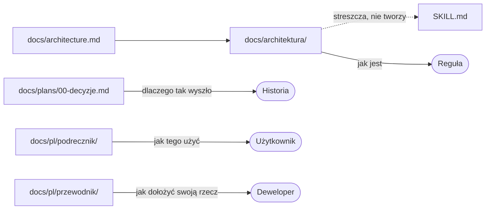

# Konwencje pisania dokumentacji

Dwie konwencje ustalone w kroku 62
([plans/archiwum/62-porzadek-dokumentacji.md](plans/archiwum/62-porzadek-dokumentacji.md)):
**jak rysować diagram** i **jak pokazywać kod**. Gdzie który dokument mieszka
i czego w nim pisać nie wolno — [README.md](README.md), mapa dokumentacji.

## Konwencja diagramu

**Diagram jest blokiem `mermaid` w pliku `.md`** — czyli tekstem
w repozytorium: wchodzi do `git diff` i do przeglądu jak kod
([plans/00-decyzje.md](plans/00-decyzje.md), D97 nr 2). Odrzucono ASCII (graf
zależności rysowany ręcznie jest drogi przy każdej zmianie) i SVG (plik binarny
w przeglądzie oraz drugie źródło prawdy obok kodu).

Cena tego wyboru jest nazwana i zamieniona na trzy reguły.

### 1. Każdy diagram ma zdanie, które mówi to samo słowami

Zdanie stoi **przed** blokiem i jest pełnym zdaniem, nie podpisem („Rys. 3”).
Powód jest podwójny i oba są twarde: aplikacja sama jest programem
terminalowym, a w `cat` i `less` diagram widnieje jako **źródło** — czytelnik nie
ma prawa stracić na tym treści. To samo zdanie służy czytnikom ekranu.

Sprawdzian: **usuń blok i przeczytaj sam akapit.** Jeśli zniknęła informacja,
zdanie jest za słabe.

### 2. Nazwy węzłów pochodzą z repozytorium, nie z opisu

Węzeł nazywa się `FrameComposer`, `QueryRegistry`, `BackgroundProcessPort`,
`make qa` — czyli tak, jak rzecz nazywa się w kodzie albo w narzędziach.
Węzeł „warstwa składająca klatkę” jest błędem: diagram i kod rozjeżdżają się
wtedy **bez śladu**, bo nie ma czego z czym porównać. Opis idzie na strzałkę
albo do zdania.

Drobiazg składniowy, który kosztuje jeden nieczytelny diagram, jeśli się go nie
zna: **nazwa z repozytorium idzie w etykiecie, nie w identyfikatorze węzła.**
Kropka i ukośnik w identyfikatorze psują parser mermaida, więc pisze się
`zrodlo["docs/architecture.md"]`, a nie `docs/architecture.md` wprost.

### 3. Diagram pokazuje mechanizm, nie hierarchię plików

Drzewo katalogów jest **listą** i zostaje ASCII-em, jak dotąd. Mermaid wchodzi
tam, gdzie jest **ruch**: zależność, kolejność, przejście stanu, droga danych.

### Jak to wygląda w praktyce

Dokumentacja rozkłada się na cztery rodzaje wedle pytania, na które odpowiada:
reguła mieszka w rozdziale architektury, historia w planach i dzienniku decyzji,
podręcznik odpowiada użytkownikowi, a przewodnik temu, kto dokłada swoją rzecz;
`SKILL.md` nie jest piątym rodzajem, tylko skrótem architektury — strzałka do
niego biegnie w jedną stronę.



## Konwencja przykładu

**Przykład kodu jest plikiem, a dokument go wskazuje — nie kopiuje.** Powód jest
ten sam, dla którego projekt trzyma napisy w katalogach, a nie w kodzie: kopia
rozjeżdża się przy pierwszej poprawce, **i to po cichu**.

To nie jest obawa teoretyczna. Rozdział 6 dokumentu źródłowego trzymał do kroku
62 cztery bloki kodu i **dwa z nich już się rozjechały**: udokumentowany
`InvalidDirectoryPathException` nie miał `DescribesProblem`, `problemKey()` ani
`problemParameters()`, a `DirectoryRepositoryInterface::get()` nie miał
parametru `bool $includeHidden`. Nikt tego nie zauważył, bo blok w markdownie
wygląda tak samo poprawnie w dniu, w którym przestaje być prawdą.

### Dwa rodzaje przykładu i wybór między nimi

| Rodzaj | Gdzie leży | Kiedy | Czym się broni |
|---|---|---|---|
| **Prawdziwy kod** | `src/`, `bin/`, `lang/`, `tests/` | wzorzec **jest w użyciu** i chcesz pokazać właśnie to | bramka jakości pilnuje go razem z resztą aplikacji |
| **Przykład dydaktyczny** | [`examples/`](../examples/) | wzorca nie da się pokazać bez kontekstu modułu albo rzecz jest ćwiczeniem | PHPStan `max` i PHP-CS-Fixer razem z `src/` |

Zasada wyboru: **jeśli rzecz istnieje w aplikacji, wskazuje się aplikację.**
`examples/` jest dla tego, czego w aplikacji nie ma i być nie powinno — bo
przykład dydaktyczny wstawiony do `src/` byłby kodem bez użytkownika (reguła 13).

### Postać wskazania

Wskazanie to **odnośnik markdown do pliku `.php`** wraz z zakresem wierszy:

```markdown
[`examples/PortNumber.php`](../examples/PortNumber.php), wiersze 15–40
[`src/Domain/Exception/DomainException.php`](../src/Domain/Exception/DomainException.php), wiersz 21
```

Zakres pisze się półpauzą (`–`), pojedynczy wiersz — słowem „wiersz” w liczbie
pojedynczej. Wolno wskazać sam plik, bez zakresu, gdy przykładem jest **cały**
plik. Od kroku 66 `DocumentationExamplesTest` sprawdza, że wskazany plik
istnieje, a zakres mieści się w jego długości.

### Jak to wygląda w praktyce

Wzorcowy obiekt wartości projektu — `final`, `readonly`, samowalidujący się
w konstruktorze, z `equals()` zamiast porównania tożsamości — stoi w
[`examples/PortNumber.php`](../examples/PortNumber.php), wiersze 15–40. Wyjątek,
którym się broni, wraz z prywatnym konstruktorem, nazwanym konstruktorem
statycznym i technicznym komunikatem po angielsku — w
[`examples/InvalidPortNumberException.php`](../examples/InvalidPortNumberException.php).

Numer portu **nie występuje w aplikacji jako obiekt wartości** i to jest powód,
dla którego wolno go tu mieć: gdyby występował, wskazywalibyśmy `src/`.
