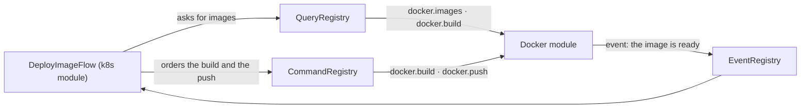
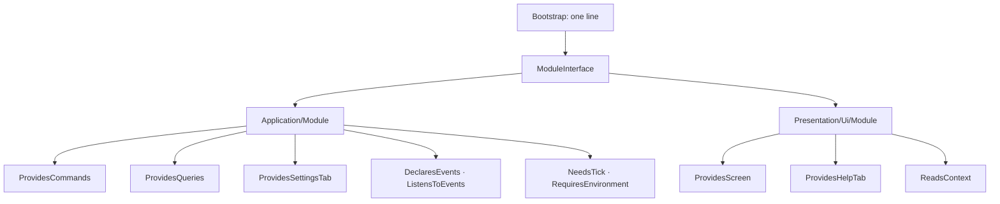

# 1. Code map

> Developer guide, part 1 of 8. [Contents](README.md) ·
> [polski](../../pl/przewodnik/01-mapa-kodu.md)

## Three sentences that settle most arguments about placement

Before you look at the directory tree, remember three sentences. In this project
they decide where something belongs — more often than intuition, and more often
than similarity of names.

1. **The core does not know what a file is.** The whole file domain — directory,
   entry, path, selection — lives in `src/Module/Browser/`, not in
   `src/Domain/`. The core's `Domain/` is thin because of that, and **that is
   how it should be**: it is the vocabulary of a terminal shell, not of a file
   manager. `CoreKnowsNothingAboutFilesTest` watches over it.
2. **A module never reaches into another module.** What looks like an exception
   goes through **a command, a query or an event** — the core's three roads, not
   a fourth. `NoModuleKnowsAnotherModuleTest` watches over it by looking at the
   `use` statements in the files.
3. **The graphical interface stands on both sides of the boundary.** A component
   knows how to look; **a primitive is what is left of that knowledge once it
   crosses the port**. That is why components sit in `Presentation/Ui` and
   primitives in `Application/Ui` — a renderer implements a port from
   `Application` and has no right to see a class from `Presentation`.

**What the second sentence looks like in practice.** The only action in the
application that crosses two modules is `k8s.deploy-image`: the cluster module
builds an image and pushes it, while knowing **nothing about Docker beyond three
strings**. It asks the core — `CommandRegistry` for the action, `QueryRegistry`
for the answer — and the core holds registries somebody else wrote into.
A switched-off Docker module breaks nothing in the process: the registry returns
a reason instead, and the user gets a sentence.



## The repository tree

```
Makefile     entry points to every process of the project (`make` prints the list)
bin/         CLI entry scripts (the application, diagnostic tools, the build)
src/         application code (PSR-4, namespace LightManager\)
src/Module/  seven modules — each with its own layers and its own messages
tests/       PHPUnit tests (namespace LightManager\Tests\)
lang/        interface message catalogues (core)
assets/      application assets (the default track, effect samples)
docs/        documentation — the entry point is docs/README.md (the map)
examples/    examples the documentation points at, covered by the quality gate
build/       the result of `make build` — outside the repository (.gitignore)
```

## The four layers of the core

Dependencies run **inwards only**: `Presentation → Application → Domain`, and
`Infrastructure → Domain/Application` by implementing interfaces. There is no
arrow the other way and there will not be.

| Layer | What lives there | What does not |
|---|---|---|
| `Domain/` | Shell concepts: `Message`, `MessageTone`, `Preview`, `RendererMode`, `ScrollPosition`, the exception hierarchy | Singletons, Imagick, `pcntl`, the terminal, messages, **anything about a file** |
| `Application/` | Contracts and data: ports, commands, queries, events, the module contract, frame primitives, settings and input DTOs | Technology implementations — it knows interfaces only |
| `Infrastructure/` | Technology: terminal, Imagick, GLFW, child processes, files, message catalogues, diagnostics | Decisions about what to draw |
| `Presentation/` | The loop, screens, components, overlays, key bindings, `Bootstrap` | Reading data outside the query registry |

Subdirectories worth knowing right away:

| Directory | What for |
|---|---|
| `Application/Port/` | 16 core ports — input, viewport, renderer, settings, background work, clipboard, file operations, trash, previews |
| `Application/Command/` | The command contract, arguments, the line parser, the registry, the history |
| `Application/Query/` | The query contract, the registry, the result, generation, ownership |
| `Application/Module/` | The module contract and the capabilities that speak **in data** |
| `Application/Ui/` | The frame, planes, rectangles, theme roles and **the primitives** |
| `Presentation/Ui/Component/` | 27 components — list, table, tree, text view, fields, tabs |
| `Presentation/Ui/Overlay/` | Overlays: question, choice, text field, list, progress, message |
| `Presentation/Ui/Module/` | Module capabilities that mention a `Presentation` type |
| `Presentation/Cli/` | `GameLoop`, `InputHandler`, `FrameComposer`, `LoopState`, `Bootstrap`, core screens |
| `Infrastructure/Rendering/` | The three translators of primitives: Sixel, text, OpenGL |

## A module repeats the same division

A module is not a plug-in of a different shape — it is **the same architecture
at a smaller scale**:

```
src/Module/AddressBook/
    Application/           the module's data, ports and logic
    Application/Port/      what the module needs from the world
    Domain/                the module's concepts along with its exceptions
    Domain/ValueObject/
    Infrastructure/        implementations of the module's ports
    Presentation/          the module, its screen, its components
    Presentation/Command/  the module's commands — they get the loop state
    Presentation/Query/    the module's queries
    lang/                  pl.php and en.php, merged with the core catalogue
```

**The module contract is identity alone, and everything a module brings is
a separate capability.** `ModuleInterface` asks for five things — the
identifier, the name key, the description key, the shortcut and the message
directory; the rest are interfaces a module implements when it really brings
something. The layer boundary is **the type in the signature**: capabilities
that speak in data live in `Application/Module`, and those naming a type from
`Presentation` live in `Presentation/Ui/Module`. The core learns about a module
from **one line in `Bootstrap`** and knows none of its classes.



**A module need not exist in every layer.** The example module
([`examples/modul-przykladowy/`](../../../examples/modul-przykladowy/)) has
a command, a query, a setting and messages — and not a single file in `Domain/`,
because it has no concepts of its own. That is correct, not unfinished.

## Where the rules live

| Kind of knowledge | Place |
|---|---|
| **Rule** — how it is and why | the [source document](../../architecture.md) and the chapters in [`docs/architektura/`](../../architektura/) |
| **A summary of the rules for working on code** | [`SKILL.md`](../../../.claude/skills/light-manager-conventions/SKILL.md) — a summary, **not a source** |
| **Why it turned out this way, what was rejected** | the [decision log](../../plans/00-decyzje.md) — see [ch. 7](07-decision-log.md) |
| **What is done, what is planned** | the [plan](../../plans/00-index.md) |
| **How to use it** | the [manual](../manual/README.md) |

When the summary and the chapter disagree, **the chapter is right**.

## Five guardians of the rules, in tests

The rules in this chapter are not a request — they are watched by tests that
read the code and turn the gate red:

| Test | What it watches |
|---|---|
| `CoreKnowsNothingAboutFilesTest` | no core file refers to a file-domain type |
| `NoModuleKnowsAnotherModuleTest` | no module has a class from another module in its `use` |
| `QueryIsTheOnlyReadPathTest` | data is read through the query registry, not through somebody else's objects |
| `PrimitiveTranslationTableTest` | every primitive has a translation on all three paths |
| `StatusHintsFlowTest` | the status bar promises exactly the keys that are declared |

The last one has a boundary worth remembering: it watches the keys that are
**declared**, not the ones that are **handled** — a key that works without
a `KeyBinding` slips right past it. See [trap 10](05-traps.md).

## Where to go next

- [2. The frame lifecycle](02-frame-cycle.md) — how it all turns
- [3. How to add your own thing](03-how-to-add.md) — eight guides
