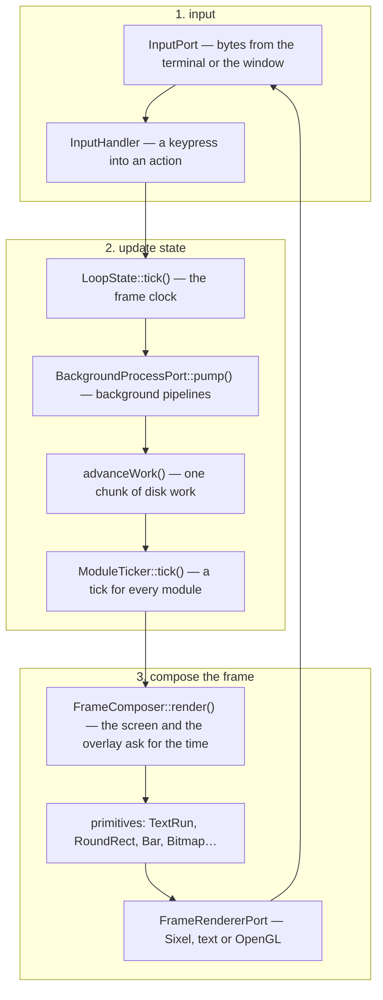

# 2. The frame lifecycle

> Developer guide, part 2 of 7. [Contents](README.md) ·
> [polski](../../pl/przewodnik/02-cykl-klatki.md)

## One road from a byte to a pixel

The application is **a main loop of the kind games use**: it reads input,
updates state, composes the whole frame and pushes it to the terminal — thirty
times a second, whether or not anything changed. There are no partial redraws,
no "refresh this fragment" events and no waiting for input: the frame goes out
regardless.

A tick splits into **three phases**, and the difference between them is the one
thing newcomers break most often: input turns a keypress into an action, the
state phase advances everything that happens by itself — background work, chunks
of disk work, module ticks — and only at the end does `FrameComposer` **read**
the state and build a picture out of it. Drawing changes nothing.

## What is allowed in which phase

| Phase | Allowed | Not allowed |
|---|---|---|
| **Input** | turn a keypress into an action, change state, open an overlay | waiting for anything — the loop is standing still |
| **Update state** | change the disk, advance background work, tick the modules, expire messages | drawing |
| **Compose the frame** | read state and build primitives; ask for the frame clock | **changing anything** — not the state, not the disk, not the settings |

**The rule newcomers break most often: work that changes the disk advances in
`GameLoop`, not in `draw()`.** It is tempting to add "one more copy step" where
you are already computing what to draw — and then the frame stops being
a function of the state and starts changing it. The symptom: a visible change
depends on whether the window happened to be visible.

## What lives between frames

**A component is stateless and is created anew in every frame.** Whatever has to
survive — a list window position, collapsed sections, a preview scroll — lives
**next to** the component: in the screen state, in the module or in `LoopState`,
and enters the component as an argument.

The practical consequence: you cannot "remember something in a component". If
you need to, you need a place next to it — and that is the right answer, not
a workaround.

## Three paths, one vocabulary

`FrameComposer` does not know which path the application is running on. It
builds **primitives** — seven shapes, a **closed** vocabulary — and only then
does a renderer turn them into Sixel, into ANSI bytes or into OpenGL calls.

| Primitive | What it is |
|---|---|
| `TextRun` | a run of characters in a theme role |
| `TextMark` | text on its own background — a filter match, a content selection |
| `RoundRect` | a rectangle with rounded corners — panel framing |
| `CornerBrackets` | corner brackets — framing on a poor palette |
| `Bar` | a bar: progress, fill, divider |
| `Bitmap` | an image — a thumbnail, a preview |
| `Scrollbar` | a scrollbar |

The count is checked with one command, not from memory:
`grep -rl 'implements Primitive' src/`. The documentation got this wrong once —
step 30 called `TextMark` **the eighth** — and the correction took twenty-six
steps.

**The vocabulary is closed and is opened once every dozen or so steps**, with
explicit consent — because every new shape is an obligation for **three**
renderers at once. Before you propose one, see [ch. 4](04-before-you-add.md).

`PrimitiveTranslationTableTest` watches over it: a primitive without
a translation on any path turns the gate red.

## Work longer than a frame

Nothing that takes longer than one frame has the right to stop it. The project
has **two roads** for that, and the difference between them is sharp:

| Road | When | Where it advances |
|---|---|---|
| **Chunked work** | the work is yours and can be sliced (a checksum, a copy, deleting a tree) | the "update state" phase, one chunk per frame |
| **Child process** | the work is done by somebody else's program (`ssh`, `sftp`, `kubectl`, `du`, `docker compose`) | `BackgroundProcessPort::pump()`, once per frame |

Both share the same closing rule: **cleanup goes two ways** — the normal one and
the emergency one — because a child process nobody killed will outlive the
application. Details: [ch. 3](03-how-to-add.md), "New background work".

## The module tick

A module may ask for **one call per frame** (`NeedsTick`) — **regardless of what
is on top**. That is the whole difference from asking for the frame clock: the
clock is asked for by what is visible, while a tick goes to a module that must
work even when its screen is not visible (the playlist has to notice that
a track ended).

Three rules of the tick, each with a reason:

- **a tick must be cheap** — comparing state, never reading the disk or asking
  the network;
- **a tick forces nothing** — it does not ask for a redraw, because the frame
  goes out anyway;
- **a module that breaks inside its tick does not break the loop**.

A trap the project has already paid for: a query for authentication material
called **on every tick**, thirty times a second. See [trap 8](05-traps.md).

## Leaving

The terminal is restored to the state it was in **through three paths**: signal
handling (SIGINT, SIGTERM, SIGHUP, SIGQUIT), the process shutdown function (an
uncaught exception included) and an explicit `restore()`. The only exception is
`SIGKILL`, which cannot be caught.

The cleanup order matters and is written down in `Bootstrap::shutdown()`: GL
resources go **before** the context, child processes before the ports, the
terminal last.

## Where to go next

- [3. How to add your own thing](03-how-to-add.md) — eight guides
- [5. Traps](05-traps.md) — ten things the project has already paid for
