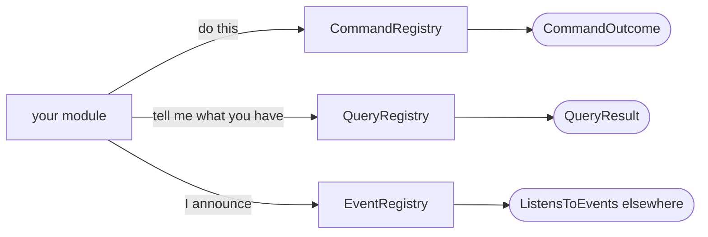
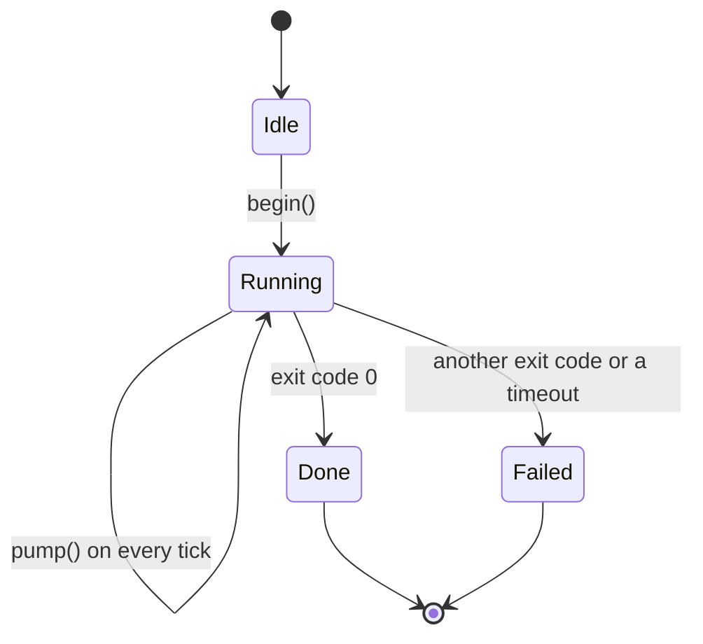

# 3. How to add your own thing

> Developer guide, part 3 of 8. [Contents](README.md) ·
> [polski](../../pl/przewodnik/03-jak-dodac.md)

Eight guides, each in the same shape: **when to use it / steps / example / what
the gate checks / what not to do**.

Before you start: if your thing is **a new primitive** or **a change in the core
instead of a module**, read [ch. 4](04-before-you-add.md) first — there the
answer is almost always "no".

**Three registries, three questions.** The core holds three lists and they are
the whole conversation between a module and the world: `CommandRegistry` answers
"do this" (a name with its owner's prefix), `QueryRegistry` answers "tell me
what you have" (**the only path to reading data**), and `EventRegistry` answers
"something happened that may concern somebody" (a closed vocabulary of events).
There is no fourth road — and what looks like a need for one is usually a fault
in how the modules were cut.

---

## A new module

**When.** Always, when you are adding a feature. **A new feature is a module in
`src/Module/`, not a change in the core** (rule 15) — and the fact that the core
would have to be touched is a sign of a flaw in the module's design, not
a reason for an exception.

**Steps.**

1. Pick an **identifier** matching `[a-z][a-z0-9-]*`. One string plays three
   roles: the key in the configuration file (`modules.<id>`), the message prefix
   (`module.<id>.`) and the command namespace (`<id>.`).
2. Create `src/Module/<Name>/` and repeat the same division of layers as in the
   core — **only those you actually need**.
3. Write the module class in `Presentation/` with the `Module` suffix. Implement
   `ModuleInterface` — that is **identity only**: `id()`, `nameKey()`,
   `descriptionKey()`, `shortcut()`, `translations()`.
4. **Add the capabilities you need** — each is a separate interface:

   | Capability | Where it lives | What it brings |
   |---|---|---|
   | `ProvidesCommands` | `Application/Module` | commands in the `F12` window |
   | `ProvidesQueries` | `Application/Module` | queries |
   | `ProvidesSettingsTab` | `Application/Module` | a settings tab |
   | `DeclaresEvents` | `Application/Module` | events the module announces |
   | `ListensToEvents` | `Application/Module` | receiving somebody else's events |
   | `NeedsTick` | `Application/Module` | one tick per frame |
   | `RequiresEnvironment` | `Application/Module` | an environment condition; unmet, it **rejects the module along with the reason** |
   | `ProvidesScreen` | `Presentation/Ui/Module` | a screen under `Ctrl`+a letter |
   | `ProvidesHelpTab` | `Presentation/Ui/Module` | your own rows in `F1` |
   | `ReadsContext` | `Presentation/Ui/Module` | the path and the selection from the session |

   The layer boundary is **the type in the signature**, not a hunch: a capability
   that mentions a `Presentation` type lives in `Presentation`.
5. Create `lang/pl.php` and `lang/en.php` with keys under `module.<id>.`.
6. **Add one line to `Presentation/Cli/Bootstrap.php`.**

**Example.**
[`examples/modul-przykladowy/PrzykladModule.php`](../../../examples/modul-przykladowy/PrzykladModule.php),
lines 49–101 — a module without a screen, bringing a command, a query and
a setting. A screen, a help tab and a tick are shown by a real module:
[`src/Module/AddressBook/Presentation/AddressBookModule.php`](../../../src/Module/AddressBook/Presentation/AddressBookModule.php).

**What the gate checks.** `NoModuleKnowsAnotherModuleTest` (no `use` from
another module), the message catalogue test (a key without a translation and the
other way round), and with a shortcut — a letter collision, which
`ModuleRegistry` rejects **along with the whole module**, not just the shortcut.

**What not to do.**

- **Do not reach into another module.** You need its data → a query. You want it
  to do something → a command. You want to know something happened → an event.
- **Do not take a letter the terminal has taken.** `c` and `z` are signals, and
  `h`, `i`, `j` and `m` arrive as the same byte as `Backspace`, `Tab` and
  `Enter`. Twenty are left.
- **Do not accept that a module costs more than one line in `Bootstrap`.** If it
  does — that is a defect to fix, not a property.

---

## A new command

**When.** When an action should have a name: so it can be invoked from `F12`,
enter the `F9` menu and be repeatable from the history. A command is also **the
only road by which a module asks another module to act**.

**Steps.**

1. A class in your module's `Presentation/Command/` (core commands —
   `Presentation/Cli/Command/`), implementing `CommandInterface` from
   `Application/Command`.
2. `name()` starts with the owner's identifier. `CommandRegistry` enforces the
   prefix.
3. `descriptionKey()` returns **a catalogue key**, never a string.
4. `arguments()` **declares** the arguments: name, label key, kind, `required`,
   suggestion source. The line is parsed by one parser in the core.
5. `execute()` returns a `CommandOutcome`: `done()`, `stay()`,
   `opens($screenId)` or `quit()`.
6. Add the class to your module's `commands()`.

**Example.**
[`examples/modul-przykladowy/Command/PowitanieCommand.php`](../../../examples/modul-przykladowy/Command/PowitanieCommand.php),
lines 35–82.

**What the gate checks.** The registry will reject a command with somebody
else's prefix; `QueryCatalogueTest` and the message catalogue test — a missing
description or argument label in either language.

**What not to do.**

- **Do not open an overlay with a screen id.** `CommandOutcome::opens()` is for
  **screens**; an overlay arrives through the `OpensOverlay` capability.
- **Do not parse the line yourself.** A command receives `CommandInput` with the
  values ready — otherwise each one would explain itself to the user
  differently.
- **Do not return a message as a string.** `Message` is a translated sentence
  plus a tone.

---

## A new query

**When.** When something should **return data** — to your screen, to another
module or to a human in the `F12` window after `Tab`. **The query registry is
the only read path** and there is no second one (rule 11w).

**Steps.**

1. A class in your module's `Presentation/Query/`, implementing
   `QueryInterface`.
2. `name()` with the owner's prefix, `descriptionKey()` as a key.
3. `generation()` — **a real change counter**, not a timestamp. `Generation`
   bumps it when what the query returns changes; that is how the registry knows
   it need not recompute the answer every frame.
4. `ask()` returns a `QueryResult`:

   | Form | When |
   |---|---|
   | `QueryResult::of($rows)` | the rows are ready at hand |
   | `QueryResult::lazy($fn)` | the rows are costly — a closure builds them only when asked |
   | `QueryResult::owned($owner, $payload, $fn)` | the owner gets a typed payload, everyone else gets rows |
   | `QueryResult::value($field, $value)` | a single value |
   | `QueryResult::failed($problemKey)` | there is no answer, and it is known why |

5. Add the class to your module's `queries()`.

**Example.**
[`examples/modul-przykladowy/Query/StanQuery.php`](../../../examples/modul-przykladowy/Query/StanQuery.php),
lines 35–82.

**What the gate checks.** `QueryIsTheOnlyReadPathTest` — whether anyone reads
data outside the registry; `QueryCatalogueTest` — the description in both
catalogues, and whether it fits in the window.

**What not to do.**

- **Do not change anything in `ask()`.** A query reads. Writing goes through
  a command.
- **Do not return authentication material in ordinary rows.** A credential gets
  its own query, marked as not held in the registry's memory.
- **Do not call somebody else's query on every tick.** See
  [trap 8](05-traps.md).
- **Do not answer "I do not know" with silence.** Work in progress returns **the
  state of the work**, not an empty answer.

---

## A new setting

**When.** When the user should change something and **it should survive
a restart**.

**Steps.**

1. Add a `ModuleSetting` to your module's declarations — pick the kind out of
   five: `toggle()`, `choice()`, `number()`, `text()`, `secret()`.
2. Label key: `module.<id>.setting.<key>`; the messages into both catalogues.
3. Read the value through `Settings::moduleValue()` and **give the reading
   a named meaning** — a `saysLoudly()` method instead of a comparison with
   a string scattered across the module.
4. `settingsTab()` returns a `ModuleSettingsTab` with a label and a list of
   positions. The core draws it, walks the cursor through it and saves the
   values.

**Example.**
[`examples/modul-przykladowy/PrzykladSettings.php`](../../../examples/modul-przykladowy/PrzykladSettings.php),
lines 27–72.

**What the gate checks.** The message catalogue test; `SettingsFlowTest` and
`SettingsScrollFlowTest` — whether the position can be scrolled to and changed.

**What not to do.**

- **Scalars only.** A list of tracks, an array of entries, anything nested — into
  the module's own file, not into the settings.
- **Do not assume the value from the file is valid.** A value outside the list
  of stops falls back to the default, and the user gets a warning naming the
  position.
- **Do not count on an immediate effect where there is none.** The module switch
  and the startup module take effect **after a restart** — and the screen says so
  plainly.

---

## A new component

**When.** When you need an interface element that is not among the 27 already in
`Presentation/Ui/Component/`. **Check first that it really is not there** — the
list, the table, the tree, the text view, tabs, sections, fields, scrollbars and
buttons all exist.

**Steps.**

1. A class in `Presentation/Ui/Component/`, drawing itself with primitives.
2. **A component is stateless** — it is created anew in every frame. Whatever has
   to survive the frame lives next to it: in the screen state or in the module.
3. If it should accept keys, implement `FocusableInterface`: `handle()` returns
   a `bool`, and **an unhandled key travels upwards**.
4. Declare `bindings()` — **the same source** feeds the status bar and the list
   in the `F1` window.

**Example.** The simplest of the existing ones:
[`src/Presentation/Ui/Component/Label.php`](../../../src/Presentation/Ui/Component/Label.php).
A component with focus and bindings:
[`src/Presentation/Ui/Component/TextInput.php`](../../../src/Presentation/Ui/Component/TextInput.php).

**What the gate checks.** `StatusHintsFlowTest` — whether the status bar
promises exactly the declared keys; the golden frames — whether the picture
changed by accident.

**What not to do.**

- **Do not create a component with no recipient in the application** (rule 13).
  A component "for the future" is code nobody checks.
- **Do not remember anything inside a component.** If you must — you need a place
  next to it.
- **Do not read inside a component.** A component gets its content ready; the
  file is read by the module that knows what for.

---

## A new overlay

**When.** When an action must **ask** something before it runs: a confirmation,
a choice, a name, a path, progress.

**Steps.**

1. Check whether one of the existing ones in `Presentation/Ui/Overlay/` will do:
   `ConfirmOverlay` (yes/no), `ChoiceOverlay` (several answers), `PromptOverlay`
   (a text field), `PickOverlay` (a list), `ProgressOverlay` (progress),
   `MessageOverlay` (a message). **New overlays appear rarely.**
2. The class implements `OverlayInterface`: it draws itself, declares
   `bindings()` and **consumes or passes on a key**.
3. **The action arrives as a closure**, not as an identifier — the overlay does
   not know what it does, only whom to call.
4. The overlay returns an `OverlayOutcome`: it stays, it closes, or it closes
   with a result.
5. An overlay is **modal**: nothing beneath it will see a key, and clicking
   outside it does nothing and does not close it.

**Example.** [`src/Presentation/Ui/Overlay/ConfirmOverlay.php`](../../../src/Presentation/Ui/Overlay/ConfirmOverlay.php)
— the dangerous variant puts the focus **on the refusal**, so a held `Enter`
hits "no".

**What the gate checks.** `StatusHintsFlowTest`; the functional flows that open
the overlay; `SelectionInOverlayFlowTest` — whether the overlay's content can be
selected and copied.

**What not to do.**

- **Do not open two overlays at once.** A chain of questions is an overlay that
  opens the next one when it closes, not two on a stack.
- **Do not assume the user will answer.** `Esc` must mean something, and with
  work in progress — interrupt it and clean up.
- **Do not ask about something you know.** The copy overlay fills the target
  with the other pane's directory instead of demanding a path.

---

## New background work

**When.** When the work takes longer than a frame: somebody else's program
(`ssh`, `kubectl`, `du`, `docker compose`) or your own walk over a large tree.

**Background work is a state machine and the loop only pushes it along.**
`BackgroundStage` has four states and the transitions happen **on the tick**,
not in a wait: `begin()` moves from `Idle` to `Running`, every tick calls
`pump()`, and the result ends in `Done` or `Failed` — both of which are ordinary
states, not exceptions. The frame never waits, and on the way out **no child
process is left behind**: `Bootstrap::shutdown()` and the registered shutdown
function clean them up.

**Steps.**

1. Decide the road: **a chunk per frame** (the work is yours and can be sliced)
   or **a child process** (the work is done by somebody else's program).
2. For a process: a port in `Application/Port/` **speaks about the work, not
   about the result** — `begin()`, the state, `takeOutcome()`.
3. **The shape of the output is declared by the order**, not by the recipient:
   whether the output is content or a message — because that decides whether the
   streams may be merged (see [trap 1](05-traps.md)).
4. Advance the work in the **state phase**, never while drawing.
5. **Clean up two ways**: the normal one (the work finished) and the emergency
   one (`Bootstrap::shutdown()`, a signal, an exception). A process nobody
   killed will outlive the application.

**Example.** [`src/Application/Port/BackgroundProcessPort.php`](../../../src/Application/Port/BackgroundProcessPort.php)
— the contract; its use in `src/Module/FileInfo/` (directory disk usage
via `du`).

**What the gate checks.** Functional flows with stubbed ports — **no test calls
a real `ssh` or `kubectl`**, and that is a criterion, not a convenience.

**What not to do.**

- **Do not wait for a process in a loop.** You ask once per frame whether it is
  done.
- **Do not assume an exit code other than 0 means failure.** See
  [trap 7](05-traps.md).
- **Do not feed a child anything on its input.** A child gets no input — see
  [trap 6](05-traps.md).
- **Do not hand a "take once" channel to two recipients.** See
  [trap 9](05-traps.md).

---

## New messages and the second language

**When.** Always, when you write anything the user will see. **No message is
hard-coded** — without exceptions.

**Steps.**

1. The key: `module.<id>.<what it is>.<detail>` for a module, without the
   `module.` prefix for the core.
2. Add it to **both** files: `lang/pl.php` and `lang/en.php`.
3. Substitutions in braces and **named**: `{imie}`, `{path}` — not positional,
   because word order differs between languages.
4. Plurals go their own road (`PluralRule`), and the number itself reaches the
   substitutions as `{count}`.
5. In the code you carry **the key**, and the sentence is assembled by
   `TranslatorPort::translate()`.

**Example.**
[`examples/modul-przykladowy/lang/pl.php`](../../../examples/modul-przykladowy/lang/pl.php)
and [`en.php`](../../../examples/modul-przykladowy/lang/en.php) next to it.

**What the gate checks.** The message catalogue test: **a key without
a translation and a translation without a key are the same defect**.

**What not to do.**

- **`Domain` never reaches for messages at all.** A domain exception carries
  **data** (a path, a name) as typed fields, and the sentence is assembled by
  `Presentation` from the exception's class. The exception's own message is
  technical and in English — written for whoever reads the stack trace.
- **Do not translate key names.** "Enter" and "F10" are printed on a keyboard,
  not sentences of the interface — they bypass the catalogue.
- **Do not glue a sentence out of pieces.** Two keys joined in code give
  a sentence that cannot be translated.

---

## Where to go next

- [4. Before you add](04-before-you-add.md) — two things the answer to is "no"
- [5. Traps](05-traps.md) — ten things the project has already paid for
- [6. Workflow](06-workflow.md) — the order of processes and the gate
