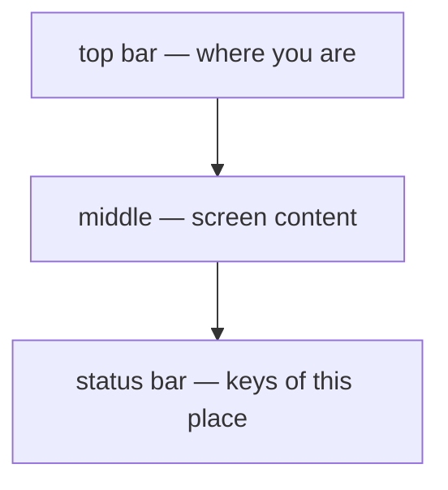

# 1. What it is

> User manual, part 1 of 7. [Contents](README.md) ·
> [polski](../../pl/podrecznik/01-czym-to-jest.md)

**Light Manager is a file manager that runs in a terminal — and in a window.**
The whole screen frame is built as **one image**, not as letters printed one
after another: the application draws it in full thirty times a second, the way
a game does. That is where everything distinctive about it comes from — image
thumbnails next to file names, frames that really are frames, and a pane split
that changes in the same frame in which you press the key.

## What you see

A frame has **three zones**, and the layout is the same on every screen: the
top bar says where you are (path, host, cluster), the middle shows the content —
a list, a tree, a file description or a container log — and the status bar at
the bottom is **a cheat sheet for the keys of the place you are standing on**.
That last one changes most often.

The status bar is not decoration and is worth reading: it shows **the keys of
the focused place first**, then the keys of the whole screen, and finally the
ones that work everywhere. When the window is too narrow, entries give way from
the end — `F1` goes last, because without it the way to the full list goes too.

## Three paths, one application

The same application draws itself in three ways. The choice is made **at
startup** and changes nothing about what you see and what you do:

| Path | When | What it gives |
|---|---|---|
| **Sixel** | the terminal speaks the Sixel protocol (XTerm, WezTerm, foot, mlterm) | the full picture: thumbnails, frames, palette colours |
| **Text** | the terminal has no Sixel — the fallback path | the same layout and the same keys, drawn with characters |
| **Windowed** | started with `--window` (needs the `glfw` extension) | a native OpenGL window; full colour depth, a cheaper frame than in a terminal |

The text path **is not a crippled version** — it is the same application with
a different translator of the picture. Every key, module and command works there
the same way.

Which path you got is shown by the "Application" tab in the help window (`F1`).
If you expected Sixel and got text, see [chapter 2](02-installation.md), section
"When something does not work".

## What it is made of

Beyond the core — the loop, the frame, the overlays and the status bar —
**everything is a module**. There are seven, each with its own screen under
`Ctrl`+a letter:

| Module | Shortcut | What for |
|---|---|---|
| File browser | `Ctrl`+`B` | the file manager itself: list, tree, operations |
| File info | `Ctrl`+`D` | the full picture of the selected entry, with a content preview |
| Audio | `Ctrl`+`A` | a playlist that plays alongside your work with files |
| Address book | `Ctrl`+`W` | the shared list of places the other modules connect to |
| Remote session | `Ctrl`+`S` | an SSH connection, a remote directory, file transfer |
| Docker | `Ctrl`+`O` | containers, images, logs, compose, registries |
| Kubernetes | `Ctrl`+`K` | cluster resources, pod logs, deployments |

A module the machine cannot carry **is absent from the list along with the
reason** — and that is normal behaviour, not a failure. Without an OpenSSH
client the remote session disappears, without the `curl` extension Docker does,
without `glfw` the sound goes quiet. The rest of the application works
unchanged. See [chapter 5](05-modules.md).

## What this application does not do

Worth knowing right away, so you do not go looking:

- **it does not edit files** — it shows content but never changes it;
- **it is not a terminal** — you cannot run a shell or another program in it;
- **it does not run on Windows** — it needs `stty`, so Linux or macOS;
- **it does not transfer directories over SSH** — files yes, directories no.

## Where to go next

- Never ran it → [2. Installation and first run](02-installation.md)
- It is open and you do not know what to press → [3. Screen and controls](03-screen-and-controls.md)
- You want to do one concrete thing end to end → [7. Scenarios](07-scenarios.md)
