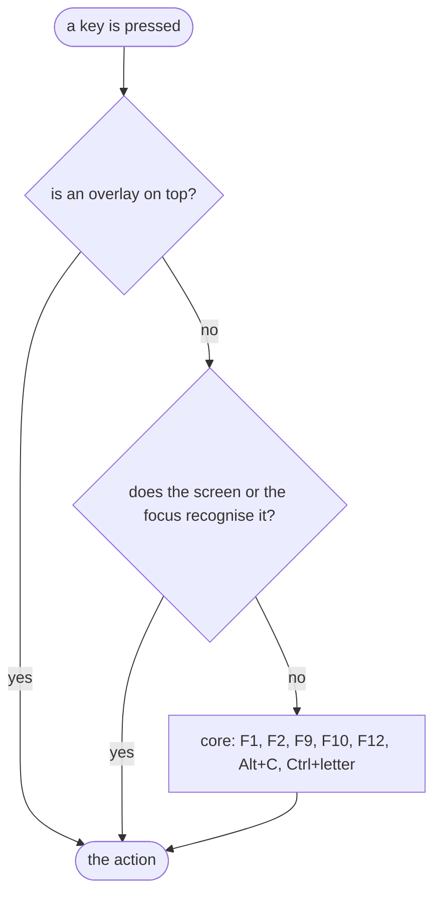
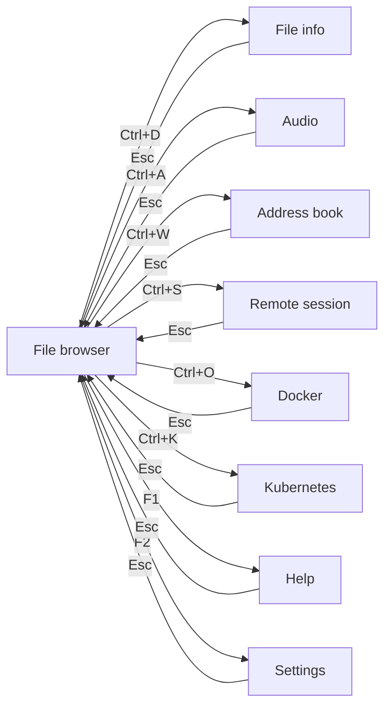

# 3. Screen and controls

> User manual, part 3 of 7. [Contents](README.md) ·
> [polski](../../pl/podrecznik/03-ekran-i-sterowanie.md)

## Focus — who gets the key

At any moment exactly one place holds the **focus**: a pane, a text field,
a tree or a list. It gets the key first, and its keys stand at the beginning of
the status bar. The focused place is recognisable by the **accent in its
border**.

A key travels three storeys and stops at the first one that recognises it:
first the **overlay**, if one is on top (it is modal — nothing beneath it sees
the key), then the **screen** together with the focused place, and finally the
**core**, that is the keys that work everywhere. That is why `Esc` means one
thing in a question (refuse), another in a filter field (drop the filter) and
another on the file list (back to the default module).

## The status bar is a cheat sheet

The bar at the bottom talks about the **focused place**: first its name and keys
(`Left pane: ↑↓ selection · Enter directory · Backspace up`), then the keys of
the whole screen, and finally the global ones together with the module
shortcuts.

Moving the focus changes the bar **in the same frame**. When the window is too
narrow, entries give way from the end — the global keys go first, `F1` goes
last, because without it the way to the full list goes too. When the hints do
not fit on one line, the bar grows to two, but it never covers a message and
never cuts an entry mid-word.

**The bar shows only what works here and now.** A conditional key — `Esc`
dropping a filter, for instance — appears only when there is something to drop.
The list below marks such keys with the word "when".

The full key list is always under **`F1`**, and it is not copied there by hand:
it comes from the same bindings the keys are handled by.

## A map of the screens

There is always exactly **one** visible screen, and `Esc` returns from it to the
default module (the file browser out of the box). The command window, the menu
and the question overlays stand **above** the screen and do not replace it.

A module shortcut works **from every screen**, not just from the browser — the
arrows start there because that is the starting place.

## The key list

The list is **grouped by place**, exactly the way the status bar and the `F1`
window group them — otherwise comparing one with the other would show two
different layouts of the same knowledge. The name of the place is the heading;
the row gives the key and the action.

### Everywhere

<!-- spis:klawisze:globalne -->
| Key | What it does |
|---|---|
| `F1` | help |
| `F2` | settings |
| `F9` | context menu |
| `F10` | quit |
| `F11` | fullscreen — **windowed mode only** |
| `F12` | command window |
| `Alt`+`C` | copy to the clipboard |
<!-- /spis -->

### Module shortcuts

<!-- spis:klawisze:moduly -->
| Key | What it does |
|---|---|
| `Ctrl`+`B` | File browser |
| `Ctrl`+`D` | File info |
| `Ctrl`+`A` | Audio |
| `Ctrl`+`S` | Remote session |
| `Ctrl`+`O` | Docker |
| `Ctrl`+`K` | Kubernetes |
| `Ctrl`+`W` | Address book |
<!-- /spis -->

### File list

<!-- spis:klawisze:lista-plikow -->
| Key | What it does |
|---|---|
| `↑` / `↓` | move the selection |
| `Enter` / `→` | enter the directory |
| `Backspace` / `←` | parent directory |
| `Space` | mark the entry and step down |
| `Shift`+`↑` / `Shift`+`↓` | mark a range |
| `*` | invert the marks on the visible list |
| `.` | show or hide hidden entries |
| `/` | narrow the list by a name fragment |
| `Ctrl`+`T` | pane as a tree or a list |
| `Tab` | move to the other pane — **when** the split is on |
| `F3` | undo stack |
| `F4` | rename the entry |
| `F5` | copy the entry |
| `F6` | move the entry |
| `F7` | new directory |
| `F8` / `Del` | move the entry to trash |
| `Shift`+`F8` / `Shift`+`Del` | delete the entry permanently |
| `Alt`+`U` | undo the last operation |
| `Esc` | drop the filter — **when** a filter is set |
| `Esc` | drop the marks — **when** there is no filter but there are marks |
<!-- /spis -->

`F8` and `Shift`+`F8` swap roles when you switch off "Delete to trash": the bare
key always does what the setting says and `Shift` always does the other thing.
The description in the status bar **follows the setting**, so it shows what the
key will really do.

### A pane switched to a tree

<!-- spis:klawisze:drzewo -->
| Key | What it does |
|---|---|
| `↑` / `↓` | move the selection |
| `→` | expand the branch |
| `←` | collapse the branch or go one level up |
| `Enter` | enter the directory |
| `Backspace` | parent directory |
<!-- /spis -->

The remaining list keys (`.`, `/`, `Ctrl`+`T`, `F4`–`F8`, `Alt`+`U`, `F3`) work
the same. The tree **neither shows nor acts on** multiple marks — going back to
the list finds the set as it was.

### The filter field

<!-- spis:klawisze:filtr -->
| Key | What it does |
|---|---|
| `↑` / `↓` | move the selection on the narrowed list |
| `Enter` | keep the list narrowed |
| `Esc` | drop the filter and go back |
| `←` / `→` / `Home` / `End` | move the caret |
| `Backspace` / `Del` | erase a character |
| `Alt`+`V` | paste from the clipboard |
<!-- /spis -->

### The undo stack (`F3`)

<!-- spis:klawisze:cofniecia -->
| Key | What it does |
|---|---|
| `↑` / `↓` | choose an operation |
| `Enter` | undo the chosen operation |
| `Esc` | close the window |
<!-- /spis -->

### File info

<!-- spis:klawisze:opis-pliku -->
| Key | What it does |
|---|---|
| `↑` / `↓` | move between sections, or scroll the preview by one row |
| `Enter` | collapse or expand the section |
| `Home` / `End` | first and last section; in the preview — start and end of the file |
| `PgUp` / `PgDn` | scroll the preview by a panel |
| `Tab` | move between the description and the preview |
| `Alt`+`Z` | wrap lines in the preview |
| `s` | compute the checksum |
| `d` | measure the directory disk usage |
| `Esc` | back to the file list |
<!-- /spis -->

### Audio — playlist

<!-- spis:klawisze:playlista -->
| Key | What it does |
|---|---|
| `↑` / `↓` | move the selection |
| `Enter` | play the selected track — **when** the playlist is not empty |
| `Space` | stop or resume — **when** the playlist is not empty |
| `F5` | add the entry selected in the browser |
| `F7` | add a track by typing its path |
| `F8` / `Del` | remove the position from the playlist — **when** the playlist is not empty |
| `Shift`+`↑` / `Shift`+`↓` | move the position within the list — **when** the playlist is not empty |
| `Tab` | go to the other panel (effects) |
| `Esc` | back to the file list |
<!-- /spis -->

### Audio — sound effects

<!-- spis:klawisze:efekty -->
| Key | What it does |
|---|---|
| `↑` / `↓` | move the selection |
| `F5` | assign the entry selected in the browser |
| `F7` | assign a file by typing its path |
| `Space` | mute it or switch it back on — **when** the event has a file |
| `F8` / `Del` | take the file away from the event — **when** the event has a file |
<!-- /spis -->

### Address book

<!-- spis:klawisze:ksiazka -->
| Key | What it does |
|---|---|
| `↑` / `↓` | move between entries |
| `←` / `→` | change chapter |
| `Enter` / `F4` | edit entry fields |
| `F6` | change sorting column |
| `F7` | add entry |
| `F8` | remove entry |
| `Ctrl`+`F` | narrow the list |
<!-- /spis -->

### Remote session — host book

<!-- spis:klawisze:hosty -->
| Key | What it does |
|---|---|
| `↑` / `↓` | choose host |
| `Enter` | connect or disconnect |
| `F5` | check session state |
<!-- /spis -->

### Remote session — remote directory

<!-- spis:klawisze:zdalny-katalog -->
| Key | What it does |
|---|---|
| `↑` / `↓` | move the selection |
| `Enter` | enter the directory |
| `Backspace` | directory above |
| `F3` | peek at the host book |
| `F5` | download the file to this machine |
| `F6` | upload the selected local file |
| `Ctrl`+`R` | read the directory again |
| `Ctrl`+`H` | show or hide hidden entries |
| `/` | narrow the list by name |
| `Esc` | drop the filter — **when** a filter is set |
<!-- /spis -->

### Docker — containers

<!-- spis:klawisze:docker-kontenery -->
| Key | What it does |
|---|---|
| `↑` / `↓` | move the selection |
| `PgUp` / `PgDn` / `Home` / `End` | page up or down, first and last |
| `Enter` | show the container log |
| `F3` | go to images |
| `F4` | start or stop the container |
| `Shift`+`F4` | restart the container |
| `F5` | narrow to a compose project |
| `F7` | build an image from a directory |
| `F8` / `Del` | remove the container |
| `e` | show the environment list |
| `r` | show the registry content |
| `Ctrl`+`R` | refresh both lists |
<!-- /spis -->

### Docker — images

<!-- spis:klawisze:docker-obrazy -->
| Key | What it does |
|---|---|
| `↑` / `↓` | move the selection |
| `PgUp` / `PgDn` / `Home` / `End` | page up or down, first and last |
| `F3` | back to containers |
| `F7` | build an image from a directory |
| `F8` / `Del` | remove the image |
| `e` | show the environment list |
| `r` | show the registry content |
| `Ctrl`+`R` | refresh both lists |
<!-- /spis -->

### Docker — logs

<!-- spis:klawisze:docker-logi -->
| Key | What it does |
|---|---|
| `↑` / `↓` | scroll |
| `PgUp` / `PgDn` / `Home` | page up or down, start |
| `End` | back to the end of the log |
| `Esc` / `F3` | back to the container list |
<!-- /spis -->

### Docker — environments (`e`)

<!-- spis:klawisze:docker-srodowiska -->
| Key | What it does |
|---|---|
| `↑` / `↓` | move the selection |
| `Enter` | choose the current environment |
| `Ctrl`+`R` | refresh the client contexts |
| `Esc` | back to the container list |
<!-- /spis -->

### Docker — image registry (`r`)

<!-- spis:klawisze:docker-rejestr -->
| Key | What it does |
|---|---|
| `↑` / `↓` | move the selection |
| `Enter` | show image tags |
| `F7` | give an image name |
| `Ctrl`+`R` | fetch again |
| `Esc` | back to the container list |
<!-- /spis -->

### Kubernetes — resource tree and details

<!-- spis:klawisze:k8s-zasoby -->
| Key | What it does |
|---|---|
| `↑` / `↓` | move the selection |
| `PgUp` / `PgDn` / `Home` / `End` | page up or down, first and last |
| `Enter` | expand or collapse the branch; in the details — open the resource |
| `Tab` | move between the tree and the details |
| `c` | cluster list |
| `k` | change context in this file |
| `n` | change the namespace |
| `y` | show the raw YAML |
| `l` | pod logs |
| `x` | reveal a secret value |
| `e` | change the secret |
| `F5` | apply a file |
| `F8` / `Del` | delete the resource |
| `Ctrl`+`R` | refresh the catalogue and the list |
<!-- /spis -->

### Kubernetes — pod logs (`l`)

<!-- spis:klawisze:k8s-logi -->
| Key | What it does |
|---|---|
| `↑` / `↓` | scroll |
| `PgUp` / `PgDn` / `Home` | page up or down, start |
| `End` | back to the end of the log |
| `Esc` | close the logs |
<!-- /spis -->

### Kubernetes — cluster list (`c`)

<!-- spis:klawisze:k8s-klastry -->
| Key | What it does |
|---|---|
| `↑` / `↓` | move the selection |
| `Enter` | select cluster |
| `Ctrl`+`R` | read the files again |
| `Esc` | close the list |
<!-- /spis -->

### Kubernetes — cluster unreachable

<!-- spis:klawisze:k8s-nieosiagalny -->
| Key | What it does |
|---|---|
| `c` | cluster list |
| `k` | change context in this file |
| `Enter` / `F5` | ask the cluster again |
<!-- /spis -->

### Settings

<!-- spis:klawisze:ustawienia -->
| Key | What it does |
|---|---|
| `↑` / `↓` | move the selection |
| `PgUp` / `PgDn` / `Home` / `End` | page up or down, first and last |
| `←` / `→` / `Enter` | on the tab bar: switch tab; on a position: change value |
| `Enter` | edit the value — **when** the position is textual |
| `Enter` | restore default settings — **when** the cursor is on the button |
| `Esc` | back to the file list |
<!-- /spis -->

While editing a textual value `Enter` **commits** and `Esc` **discards the
change** — it does not close the screen; the binding in the status bar says so.

### Help (`F1`)

<!-- spis:klawisze:pomoc -->
| Key | What it does |
|---|---|
| `↑` / `↓` | scroll |
| `←` / `→` | switch tab |
| `Enter` | collapse or expand the section |
| `Esc` | back to the file list |
<!-- /spis -->

### The command window (`F12`)

<!-- spis:klawisze:okno-komend -->
| Key | What it does |
|---|---|
| *characters* | typing the name; the list filters as you go |
| `Tab` | complete the name; on an empty line — switch to queries and back |
| `↑` / `↓` | pick from the list |
| `Enter` | run the command |
| `←` / `→` / `Home` / `End` | move the caret |
| `Backspace` / `Del` | erase a character |
| `Alt`+`V` | paste from the clipboard |
| `Esc` | close the window |
<!-- /spis -->

### The context menu (`F9`)

<!-- spis:klawisze:menu -->
| Key | What it does |
|---|---|
| `↑` / `↓` | pick from the list |
| `Enter` | run the action |
| `Esc` | close the menu |
<!-- /spis -->

### Question overlays

Four kinds of overlay, all modal — clicking outside them does nothing and does
not close them.

**Yes/no question**

<!-- spis:klawisze:pytanie -->
| Key | What it does |
|---|---|
| `←` / `→` / `Tab` | change the answer |
| `Enter` | confirm |
| `Esc` | refuse |
<!-- /spis -->

**Choice of several**

<!-- spis:klawisze:wybor -->
| Key | What it does |
|---|---|
| `↑` / `↓` | pick from the list |
| `Enter` | answer |
| `Esc` | back out |
<!-- /spis -->

**Typing text**

<!-- spis:klawisze:wpisanie -->
| Key | What it does |
|---|---|
| `Enter` | accept the name |
| `Esc` | abandon typing |
| `←` / `→` / `Home` / `End` | move the caret |
| `Backspace` / `Del` | erase a character |
| `Alt`+`V` | paste from the clipboard |
<!-- /spis -->

**Work progress**

<!-- spis:klawisze:postep -->
| Key | What it does |
|---|---|
| `Esc` | stop the work |
<!-- /spis -->

In a dangerous question — permanent deletion, restoring default settings, an
unknown host key — the focus starts **on the refusal**, so a held `Enter` hits
"no".

## The mouse

The application accepts a pointer on **all three paths**, and the behaviour is
the same everywhere:

| Action | Effect |
|---|---|
| Click on a list row | the cursor lands on that position |
| Click on the other pane | the focus moves to that pane **and** the cursor lands |
| Double click | whatever `Enter` does there (400 ms threshold, the same cell) |
| Middle button | mark the entry — what Space does, but without the step down |
| Right button | the context menu, after placing the cursor first |
| Wheel | scroll by three rows, **without moving the cursor** |
| Dragging the pane border | changes the split proportion; it is saved in the settings |
| Dragging across content | selects a rectangle to copy |
| Click on a status-bar hint | the same as its key |
| Click on a tab | switches to that tab |

The mouse can be **switched off** — `F2`, the "Appearance" tab, the "Mouse"
position. It takes effect at once and restores the terminal's native selection.
With the mouse on, native selection stays reachable under `Shift`, as in every
emulator.

## The clipboard

`Alt`+`C` copies, `Alt`+`V` pastes — in a terminal and in a window, and also on
the far side of an SSH connection.

**One of three things is copied, in this order:**

1. **content selected with the mouse** — a rectangle drawn across the frame; the
   application knows what is written under it, even where the picture is
   a bitmap;
2. **the paths of entries marked** with Space — one per line, with the path
   rather than just the name, so they are usable after pasting;
3. **the path of the entry under the cursor**, when there is neither a selection
   nor a set of marks.

The status bar says **what** was copied, not "copied" — after one and the same
key three different contents would be indistinguishable. The content of an
overlay can be copied too: `Alt`+`C` in the unknown-host-key question takes the
`SHA256:…` fingerprint, and in the query window — the whole answer.

**Pasting has one destination: the focused text field.** `Alt`+`V` above the
file list says there is nowhere to paste and **does not ask the terminal** for
the clipboard content. Multi-line content enters a single-line field with the
newlines turned into spaces.

Copying in a terminal is one-way — there is no confirmation and there cannot be
— so content longer than 64 kB ends with **a refusal and a sentence**, rather
than a silent cut in the middle.

When `Alt`+`C` or `Alt`+`V` does nothing, see
[chapter 2](02-installation.md), "When something does not work".

## Where to go next

- [4. Working with files](04-working-with-files.md) — what to do with these keys
- [5. Modules](05-modules.md) — seven screens and what is in them
