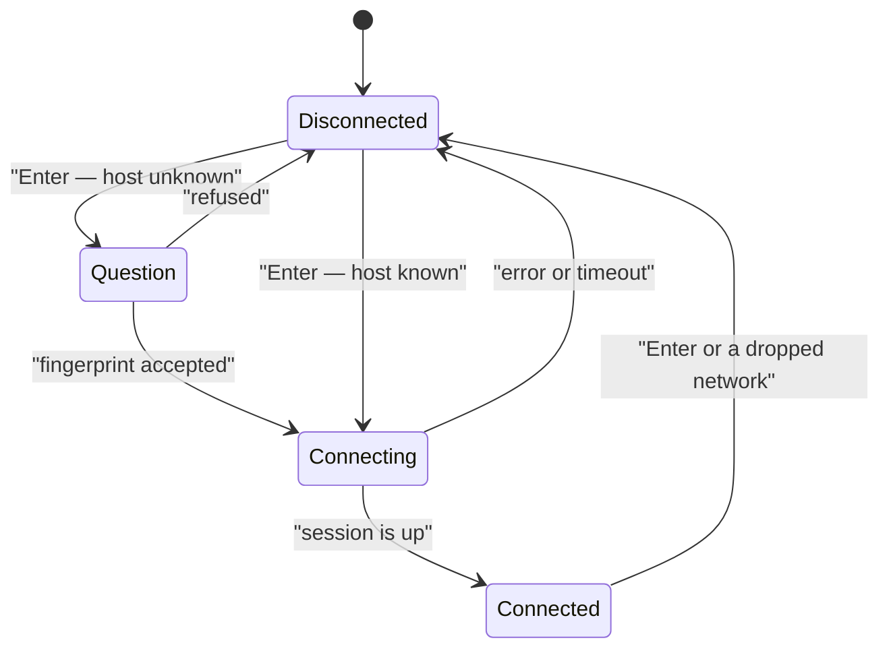

# 5. Modules

> User manual, part 5 of 7. [Contents](README.md) ·
> [polski](../../pl/podrecznik/05-moduly.md)

Everything beyond the loop, the frame and the overlays is a **module**. A module
has its own screen under `Ctrl`+a letter, its own settings tab, its own help tab
(`F1`) and its own commands prefixed with its identifier.

**A module the machine cannot carry is absent from the list along with the
reason** — and that is normal behaviour, not a failure. The reason is visible in
the status bar at startup and on the "Modules" tab in the settings.

<!-- spis:moduly -->
| Module | Shortcut | Needs | Without it |
|---|---|---|---|
| File browser | `Ctrl`+`B` | — | it cannot be switched off |
| File info | `Ctrl`+`D` | — (`file`, `du` optional) | parts of the description are missing |
| Audio | `Ctrl`+`A` | the `glfw` extension | the music commands answer with a sentence about unavailability |
| Address book | `Ctrl`+`W` | — | — |
| Remote session | `Ctrl`+`S` | an OpenSSH client | the module is not on the list |
| Docker | `Ctrl`+`O` | the `curl` extension | the module is not on the list |
| Kubernetes | `Ctrl`+`K` | `kubectl` | the module is there but has nobody to talk to |
<!-- /spis -->

## File browser (`browser`, `Ctrl`+`B`)

The file manager itself: a list or a tree, the filter, multiple marks, five
operations on the disk, the trash and undo. It is described in full in
[chapter 4](04-working-with-files.md).

One thing worth knowing here: **the browser is the module of last resort**. It
cannot be switched off or rejected, and `Esc` returns to it from every other
screen. The application also returns to it when the module set as the startup
one is disabled, was rejected, is not on the list or brings no screen — and each
time the reason is visible in the status bar, because each leads to a different
fix.

The **`browser.jump <path>`** command suggests directories from disk; `Tab`
completes the path, and a relative path counts from where you stand.

## File info (`file-info`, `Ctrl`+`D`)

**The full picture of the selected entry**, directories included: four
collapsible sections on the left, and on the right a thumbnail or **the content
of a text file**.

| Section | What it shows |
|---|---|
| Identity | name, kind from `lstat`, the description from `file`, the link target along with whether it exists, the number of directory entries |
| Size | size in units and to the byte, inode blocks, directory disk usage (`du`), the `sha256` checksum |
| Permissions | `rwx` and octal permissions, owner, group, optionally the inode and the link count |
| Times | content change, inode change, access — as a date or as "how long ago" |

**The checksum starts only after you press `s`**, and the directory disk usage
after `d` — both are off by default. The reason is the same: the first reads the
whole file, the second walks the whole tree, so neither may start on its own
while you scroll the list. They compute **piece by piece, in the background**;
the loop never waits, and after the application closes not a single process is
left behind.

**The right panel shows the content of a text file.** `Tab` moves the cursor
between the description and the preview; in the preview arrows scroll by one
row, `PgUp`/`PgDn` by a panel, `Home` returns to the beginning, `End` jumps to
the end, and `Alt`+`Z` toggles wrapping.

Three things about that preview surprise people and are intended:

- **a row is a panel row, not a file line** — with wrapping on, a file that is
  one long line scrolls by one screen row, and `PgDn` by as many rows as were
  visible;
- **after `End` the line numbers disappear** — the anchor then stands at a byte,
  and a number cannot be read from a byte without walking the whole file; `Home`
  brings them back;
- **only the visible fragment is read**, so a half-gigabyte file opens exactly
  as fast as a kilobyte one.

Whether a file is text is decided by a cascade: the extension, the description
from `file`, and finally a look at the first bytes — which is why `README` and
`.gitignore` get a preview too. The encoding is recognised from the header and
converted to UTF-8, UTF-16 and UTF-32 included. No preview is made for binaries,
and it says so plainly.

## Audio (`audio`, `Ctrl`+`A`)

Music that plays **alongside** your work with files. The screen has two panels —
the playlist and the assignment of sounds to events — and `Tab` moves between
them.

`Enter` plays the selected track, Space stops and resumes (the engine
**pauses**, so resuming returns to the same spot). Tracks are added three ways:
**`F5`** takes the entry selected in the browser, **`F7`** asks for a path, and
the **`audio.add <path>`** command works even when the screen is not visible.
`F8` removes a position, `Shift`+arrows move it within the list.

The formats are **WAV, MP3 and FLAC** — a MIDI file will not do and says so
plainly, because the engine plays samples, not notation.

**When a track ends, the next one starts on its own** — even long after you went
back to the files. What happens then is decided by the "After a track" position:
looping the list keeps going, "stop" falls silent, "repeat the track" plays the
same one over. A position pointing at a file that is gone **stays on the list**,
greyed out and labelled — the playlist skips it, but an unplugged drive does not
delete it.

**Application events can be given a sound.** The left panel (`Tab`) shows the
list of every event the application announces: five from the core (a successful
message, a warning, an error, an overlay opening, a command running) and
seventeen from the browser. Assignments use the same keys as the playlist, and
**Space mutes an assignment without taking it away**. From outside the screen
there is the `audio.hook <event> <path>` command. Sample sounds live in
`assets/sfx/`; on first run nothing is assigned, so the application stays silent
until you ask.

An effect plays **over the music**, at its own volume, and does not interrupt
the track. A held arrow does not turn a click into a rattle — the same event
stays silent for a moment after playing.

The playlist lives in `~/.light-manager/audio.json`; a file edited by hand gives
an empty list along with a message, never an error at startup.

## Address book (`address-book`, `Ctrl`+`W`)

**The shared list of places** the other modules connect to. The tabs at the top
are **chapters**: "All" shows entries with their ids, and each of the others
shows the columns of one chapter, taken straight from what the module using it
declared.

`F7` adds an entry, `F4` (or `Enter`) leads through the fields of the current
tab in a chain of overlays, `F8` removes, `F6` changes the sorting column, and
`Ctrl`+`F` narrows the list. The same is done by the `address-book.add`,
`address-book.set`, `address-book.rename`, `address-book.remove` and
`address-book.forget` commands.

Three things are worth knowing:

1. **An entry carries a name and an id**, and the id is its identity — the name
   may be changed, repeated or left empty, and references held by other modules
   will not notice.
2. **The fields on an entry are added by modules.** The remote session adds an
   address, a port, a user and an authentication method; Docker — the kind of
   connection to the daemon; Kubernetes — a `kubeconfig` file and a context.
   **One entry may carry all three at once**, and then the address is corrected
   in one place instead of three.
3. **A chapter belongs to nobody** — every module reads and changes every
   chapter through the same commands. Fields marked as secret are masked on
   screen; the state file is mode `0600`, but **there is no encryption and the
   application does not pretend otherwise**.

Lists from older versions — SSH hosts, Docker environments and Kubernetes
clusters — **move into the book by themselves** on first run; the old record is
left on disk untouched.

## Remote session (`ssh`, `Ctrl`+`S`)

An SSH connection to a host from the address book. `Enter` connects to the
highlighted entry or disconnects, `F5` checks the session state. **The address,
the login and the authentication method are changed in the book** (`Ctrl`+`W`,
the "Remote session" tab), not here — the same entry is also seen by Docker when
it raises a tunnel.

The connection goes through four states and only one of them asks anything:
a host with an **unknown fingerprint** stops the connection with a question — a
dangerous overlay, the same one used for permanent deletion, with the
`SHA256:…` fingerprint shown in full. After you agree, the line in
`~/.ssh/known_hosts` is appended by **the `ssh` client itself**; the application
never writes that file. A key that **differs** from the remembered one is not
a question but a refusal.

Authentication goes through the agent (by default), a key file or a password.
**Passwords are never stored** — the question is asked on every connection, in
a field that does not show what you type.

The session lives in a **child process**, not in the application's process, so
nothing network-related happens inside drawing a frame, and an unreachable host
ends with a message within the configured time rather than a hang. The session
state **does not refresh by itself** — it costs a separate process — that is
what `F5` is for. A session dropped by the network may therefore show as alive
for a while.

**After connecting the screen shows the remote directory**, in the same columns
as the local list. `Enter` goes in, `Backspace` goes up, `Ctrl`+`R` reads it
again, `/` narrows the list, `Ctrl`+`H` toggles hidden entries, and `F3` peeks
back at the host book. The last directory is remembered **per book entry** and
survives a restart.

The directory is read with **a single `sftp` call**, outside drawing the frame —
the list appears after a moment, and the application answers normally in the
meantime. Hidden entries cost **a new read**, not a filtering of what already
arrived: without an explicit request the server simply does not send them.

**Files move both ways**: `F5` downloads a remote entry into the directory the
browser stands in, `F6` uploads the selected local file. Both have commands
(`ssh.get`, `ssh.put`) and entries in the `F9` menu. A taken name in the target
**stops the work with a question**, and `Esc` interrupts.

An interruption **never leaves a file that looks complete**: the content lands
under a working name (`.name.lm-part`) and only when whole does it get its final
name, and the half disappears on both sides — including when it was the network
that broke mid-work. **Files are transferred, not directories**, and the
transfer copies — it does not remove the source.

## Docker (`docker`, `Ctrl`+`O`)

The containers and images of the **chosen environment**, live logs, image
builds, compose projects and registries.

`Ctrl`+`O` opens the container list, `F3` switches to images. The lists come
straight from the daemon and **refresh every few seconds while this screen is
visible**; `Ctrl`+`R` refreshes at once, and after your own action it happens by
itself.

`F4` starts or stops a container depending on its state, `Shift`+`F4` restarts
it, `F8` removes it and asks first. **`Enter` opens the log**; it keeps flowing
while you look elsewhere, arrow up holds the view, `End` returns to the end.

`F7` **builds an image**: it asks for the directory holding the `Dockerfile`,
then for a name. The context is packed minus whatever `.dockerignore` excludes.

The `docker.up` and `docker.down` commands bring a **compose project** up and
down; without an argument they take the file from the directory the browser
stands in. `F5` narrows the list to a project.

### Environments (`e`)

The letter **`e`** opens the environment list: the local socket, the `docker`
client contexts (read, never changed) and your own entries — an **SSH tunnel**
and a **TCP daemon with TLS**. `Enter` picks the current one, and the containers
and images of a remote daemon then appear in the same panels as the local ones;
the top bar says who you are talking to.

Entries are added **in the address book** (`Ctrl`+`W`, the "Docker" tab),
because that is where they live:

- **SSH tunnel** — kind `tunnel`, a target picked from the list of entries (it
  points at an entry with the "Remote session" tab filled in) and the socket
  path on the remote side (`/var/run/docker.sock` by default). When choosing the
  environment you will be asked whether to authenticate with a key/agent or with
  a password — the password is never stored;
- **TCP with TLS** — kind `tcp`, an address and a port (2376 by default) and
  three file paths: the client certificate, its key and the authority
  certificate. For compose the set must lie in one directory under the names
  `cert.pem`/`key.pem`/`ca.pem`.

The tunnel rises **on choice**, never at application startup, and after leaving
the application neither the `ssh` process nor the socket file is left behind.

A missing local socket **does not take the module away** — that is a state of
the environment, said in a sentence on the screen. The module disappears only
without the `curl` extension.

### Image registries (`r`)

The letter **`r`** opens the registry content: a list of images, and `Enter` —
their tags. A registry that exposes no catalogue (most public ones do not) will
ask for an **image name** (`F7`) instead. `Ctrl`+`R` fetches — merely entering
the view downloads nothing, because the question goes to somebody else's server.

Registries are added in the address book (the "Image registry" tab): the address
(`ghcr.io`, `localhost:5000`), a user, a **token** (a masked field), "no TLS"
for a registry on the local network, and "default", meaning the one proposed
when pushing. The same entry may be a Docker daemon and a registry at once — two
chapters, one entry.

**The token lies in the book file in plain text**, mode `0600`. Masking on
screen protects against a glance, not against reading the file.

`docker.push` asks **which** registry to push to (with one it does not ask), and
`docker.pull` fetches an image — picking the credential by the address contained
in its name.

## Kubernetes (`k8s`, `Ctrl`+`K`)

Cluster resources in a tree: **API groups, their resource kinds, their
resources**. The kinds come from the cluster, so custom resources (CRDs) appear
on their own. A branch is read **only when expanded** — only then does the
module ask the cluster for a list.

`Enter` expands a branch or opens a resource, `Tab` moves between the tree and
the details, `y` switches to the **raw YAML**, `l` opens **pod logs** (they flow
live, `End` returns to the end).

`c` picks a **cluster**, `n` changes the **namespace**, `k` changes the context
in the current file. Both choices are remembered, and the **`kubeconfig` file is
left untouched** — the application does not write to it.

`F5` **applies a file** (the path is proposed from the browser directory), `F8`
deletes a resource after confirmation, `Ctrl`+`R` refreshes the catalogue and
the list.

**Secret values are masked.** `x` reveals one, `e` opens the change: the value
as text or base64, adding a key, removing a key.

The header shows **both versions** when the client and the server differ by more
than one release. The module refuses nothing then — Kubernetes calls that
unsupported, not impossible.

**Deploying an image from a private registry** (`k8s.deploy-image`) **creates
the secret itself** in the cluster and attaches it to the deployment — without
a single manual `kubectl create secret`. The secret has a fixed name per
registry (`lm-registry-<name>`), so a repeated deployment does not multiply
them, and attaching **does not remove** secrets the deployment already had. The
credential never passes through the command line: it goes in a file with mode
`0600`, deleted right after it is applied — including when it failed.

## The startup module

The application starts with the screen of the module named by the **"Module
opened at startup"** position (the "Modules" tab); by default that is the
browser. Naming another one starts the application with its screen as the
bottom — the one `Esc` returns to.

A module can be **switched off** on the same tab. The change is saved at once
but takes effect **after a restart**: the shortcut map and the tab list are
built once, at startup.

## Where to go next

- [6. Settings and configuration](06-settings.md) — what can be changed
- [7. Scenarios](07-scenarios.md) — the modules at work, end to end
