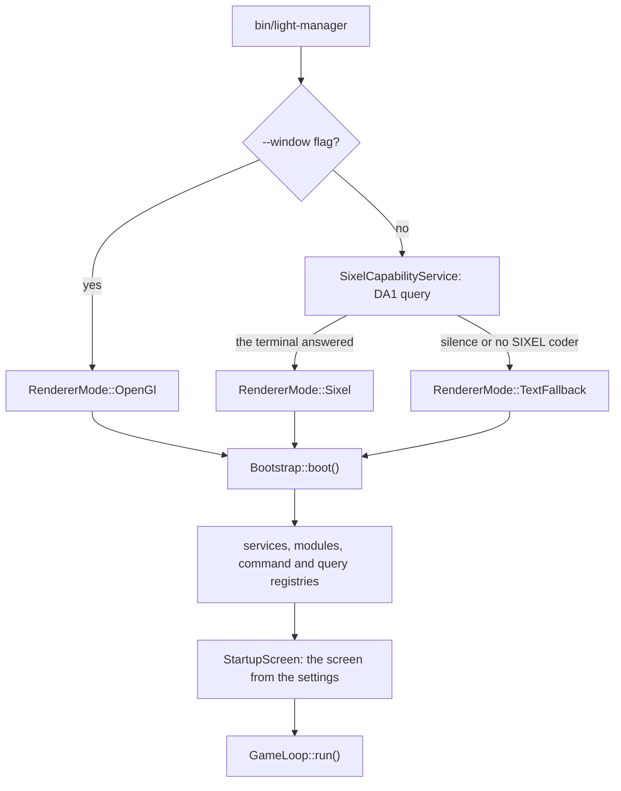

# 2. Running

> Onboarding, stop 2 of 5 · **5 minutes**. [Index](README.md) ·
> [polski](../../pl/onboarding/02-uruchomienie.md)

## What you do

```bash
make run          # the same as ./bin/light-manager
```

The application switches to a separate screen, draws a frame and waits for
input. **To leave: `F10`** — or `Ctrl`+`C`; either way the terminal returns to
the state it was in, because the restore is registered on process shutdown.

You should see **the file list of your home directory, the path in the top bar
and a status bar with keys**.

## What actually started

Before the first frame exists, the application settles one thing: **what it will
draw with**. The `--window` flag decides that without asking the terminal;
without it `SixelCapabilityService` sends a DA1 query and waits for the answer —
an answer means the Sixel path, silence or a missing coder in ImageMagick means
the text path. Only then does `Bootstrap` assemble the services, the modules and
the command and query registries, pick the startup screen from the settings and
hand control to the main loop, which spins from that moment until `F10`.



## Three paths, and how you know which one you are on

| Path | When | What you see |
|---|---|---|
| `Sixel` | the terminal answered DA1, ImageMagick has the coder | a picture: frames, thumbnails, a smooth background |
| `TextFallback` | the terminal has no Sixel, or the answer never arrived | ANSI characters instead of a picture — **the same layout** |
| `OpenGl` | started with `--window` | a native window; the terminal is left untouched |

**The application names the path itself**: `F1`, the **Application** tab. If you
expected a picture and see characters, the reason is always one of three — the
terminal has no Sixel, ImageMagick has no coder, or the terminal's answer never
arrived (typically: a multiplexer).

**This is not a failure and nothing has to be fixed to carry on.** The rest of
the path — commands, queries, the exercise, the quality gate — works exactly the
same on the text path.

If you want the picture anyway:

```bash
make probe        # what the terminal answers to DA1 — and whether it answers at all
make run-xterm    # XTerm with the full set of graphics-mode resources
make run-window   # windowed mode (needs ext-glfw)
```

## How you know you are done

You see the file list and the status bar, you **can name the path you are on**,
and you know where that name comes from (`F1`, the Application tab). You do not
have to be on the Sixel path — you have to know which one you are on.

Next: [3. Looking around](03-looking-around.md).
