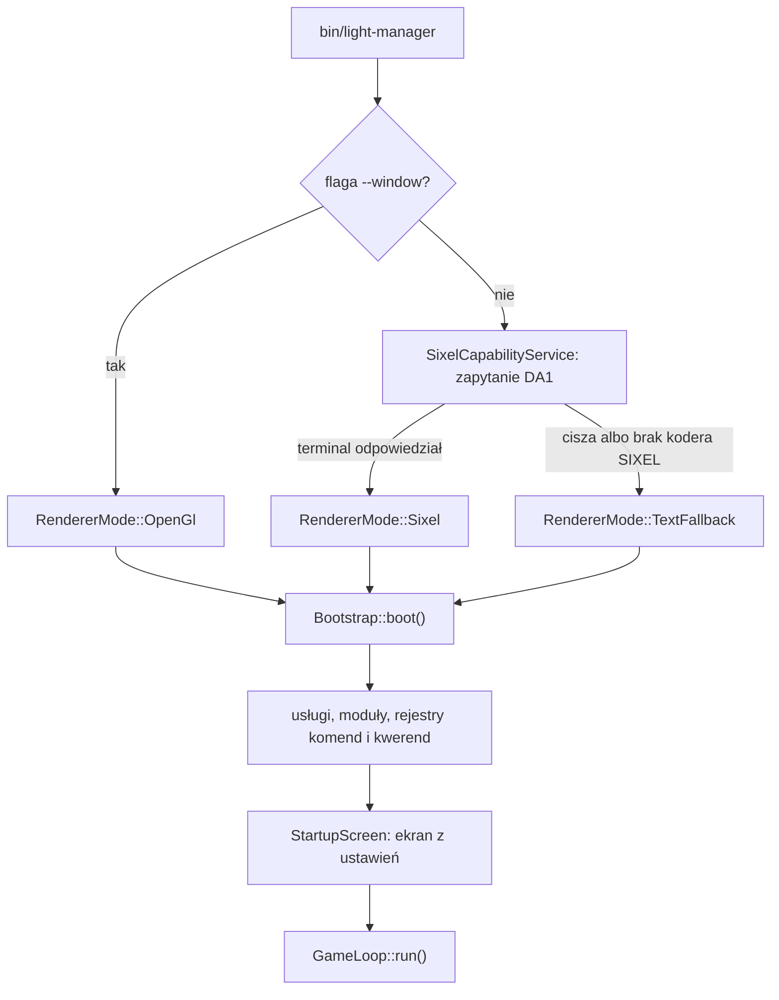

# 2. Uruchomienie

> Onboarding, przystanek 2 z 5 · **5 minut**. [Spis](README.md) ·
> [English](../../en/onboarding/02-running.md)

## Co robisz

```bash
make run          # to samo co ./bin/light-manager
```

Aplikacja przechodzi na osobny ekran, rysuje klatkę i czeka na wejście.
**Wyjście: `F10`** — albo `Ctrl`+`C`; w obu przypadkach terminal wraca do stanu
sprzed uruchomienia, bo przywrócenie jest zarejestrowane na zamknięcie procesu.

Powinieneś zobaczyć **listę plików katalogu domowego, ścieżkę w górnym pasie
i pasek stanu z klawiszami**.

## Co się w ogóle uruchomiło

Zanim powstanie pierwsza klatka, aplikacja rozstrzyga jedną rzecz: **czym
będzie rysować**. Flaga `--window` przesądza to bez pytania terminala; bez niej
`SixelCapabilityService` wysyła zapytanie DA1 i czeka na odpowiedź — jest
odpowiedź, jest tor sixelowy, nie ma odpowiedzi albo nie ma kodera w
ImageMagicku, jest tor tekstowy. Dopiero wtedy `Bootstrap` składa usługi,
moduły oraz rejestry komend i kwerend, wybiera ekran startowy z ustawień
i oddaje sterowanie pętli głównej, która od tej chwili kręci się do `F10`.



## Trzy tory i skąd wiesz, w którym jesteś

| Tor | Kiedy | Co widzisz |
|---|---|---|
| `Sixel` | terminal odpowiedział na DA1, ImageMagick ma koder | obraz: ramki, miniatury, płynne tło |
| `TextFallback` | terminal nie umie Sixela albo odpowiedź nie dotarła | znaki ANSI zamiast obrazu — **układ ten sam** |
| `OpenGl` | uruchomienie z `--window` | natywne okno; terminal zostaje nietknięty |

**Nazwę toru mówi sama aplikacja**: `F1`, zakładka **Aplikacja**. Jeśli
spodziewałeś się obrazu, a widzisz znaki, powód jest zawsze jeden z trzech —
terminal nie umie Sixela, ImageMagick nie ma kodera, albo odpowiedź terminala
nie dotarła (typowo: multiplekser).

**To nie jest awaria i nie ma czego naprawiać, żeby iść dalej.** Cała reszta
ścieżki — komendy, kwerendy, zadanie ćwiczebne, bramka — działa w torze
tekstowym tak samo.

Chcesz mimo to zobaczyć obraz:

```bash
make probe        # co terminal odpowiada na DA1 — i czy w ogóle odpowiada
make run-xterm    # XTerm z kompletem zasobów trybu graficznego
make run-window   # tryb okienkowy (wymaga ext-glfw)
```

## Skąd wiesz, że skończyłeś

Widzisz listę plików i pasek stanu, **umiesz nazwać tor, w którym jesteś**,
i wiesz, skąd ta nazwa pochodzi (`F1`, zakładka Aplikacja). Nie musisz być
w torze sixelowym — musisz wiedzieć, w którym jesteś.

Dalej: [3. Oglądanie](03-ogladanie.md).
