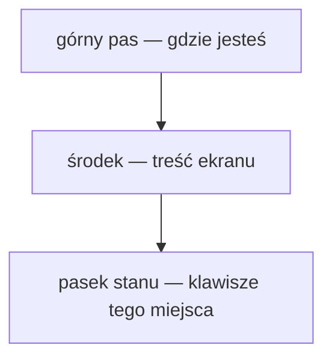

# 1. Czym to jest

> Podręcznik użytkownika, część 1 z 7. [Spis](README.md) ·
> [English](../../en/manual/01-what-is-it.md)

**Light Manager to menadżer plików działający w terminalu — i w oknie.** Cała
klatka ekranu powstaje jako **jeden obraz**, a nie jako litery wypisywane po
kolei: aplikacja rysuje ją w całości trzydzieści razy na sekundę, tak jak robi
to gra. Stąd bierze się wszystko, co ją odróżnia — miniatury obrazów obok nazw
plików, ramki, które naprawdę są ramkami, i podział na panele, który zmienia
się w tej samej klatce, w której naciskasz klawisz.

## Co widać na ekranie

Klatka ma **trzy strefy** i ten układ jest ten sam na każdym ekranie: górny pas
mówi, gdzie jesteś (ścieżka, host, klaster), środek pokazuje treść — listę,
drzewo, opis pliku albo logi kontenera — a pasek stanu u dołu jest **ściągawką
z klawiszy tego miejsca, na którym właśnie stoisz**, i to on zmienia się
najczęściej.

Pasek stanu nie jest dekoracją i warto go czytać: pokazuje **najpierw klawisze
miejsca z ogniskiem**, potem klawisze całego ekranu, a na końcu te, które
działają wszędzie. Gdy okno jest zbyt wąskie, pozycje ustępują od końca —
ostatni znika `F1`, bo bez niego znika droga do pełnego spisu.

## Trzy tory, jedna aplikacja

Ta sama aplikacja rysuje się na trzy sposoby, a wybór zapada **przy starcie**
i nie zmienia niczego w tym, co widzisz i co robisz:

| Tor | Kiedy | Co daje |
|---|---|---|
| **Sixel** | terminal umie protokół Sixel (XTerm, WezTerm, foot, mlterm) | pełny obraz: miniatury, ramki, kolory z palety |
| **Tekstowy** | terminal Sixela nie umie — tor zapasowy | ten sam układ i te same klawisze, rysowane znakami |
| **Okienkowy** | uruchomienie z `--window` (wymaga rozszerzenia `glfw`) | natywne okno OpenGL; kolory w pełnej głębi, klatka tańsza niż w terminalu |

Tor tekstowy **nie jest wersją ułomną** — to ta sama aplikacja z innym
tłumaczem obrazu. Wszystkie klawisze, moduły i komendy działają w nim tak samo.

Który tor działa u ciebie, mówi zakładka „Aplikacja” w oknie pomocy (`F1`).
Jeśli spodziewałeś się Sixela, a dostałeś tekst — zajrzyj do
[rozdziału 2](02-instalacja.md), sekcja „Gdy coś nie działa”.

## Z czego się składa

Poza rdzeniem — pętlą, klatką, oknami i paskiem stanu — **wszystko jest
modułem**. Modułów jest siedem i każdy ma własne okno pod `Ctrl`+literą:

| Moduł | Skrót | Po co |
|---|---|---|
| Przeglądarka plików | `Ctrl`+`B` | sam menadżer plików: lista, drzewo, operacje |
| Opis pliku | `Ctrl`+`D` | pełny obraz zaznaczonego wpisu wraz z podglądem treści |
| Dźwięk | `Ctrl`+`A` | playlista grająca obok pracy z plikami |
| Książka adresowa | `Ctrl`+`W` | wspólny spis miejsc, do których łączą się pozostałe moduły |
| Sesja zdalna | `Ctrl`+`S` | połączenie SSH, zdalny katalog, przesył plików |
| Docker | `Ctrl`+`O` | kontenery, obrazy, logi, compose, rejestry |
| Kubernetes | `Ctrl`+`K` | zasoby klastra, logi podów, wdrożenia |

Modułu, którego maszyna nie udźwignie, **nie ma na liście wraz z powodem** —
i to jest zachowanie normalne, nie awaria. Bez klienta OpenSSH znika sesja
zdalna, bez rozszerzenia `curl` — Docker, bez `glfw` milknie dźwięk. Reszta
aplikacji działa bez zmian. Opisuje to [rozdział 5](05-moduly.md).

## Czego ta aplikacja nie robi

Warto wiedzieć od razu, żeby nie szukać:

- **nie edytuje plików** — pokazuje treść, ale jej nie zmienia;
- **nie jest terminalem** — nie uruchomisz w niej powłoki ani cudzego programu;
- **nie działa pod Windowsem** — wymaga `stty`, czyli Linuksa albo macOS-a;
- **nie przesyła katalogów przez SSH** — pliki tak, katalogi nie.

## Dokąd dalej

- Nigdy tego nie uruchamiałeś → [2. Instalacja i pierwsze uruchomienie](02-instalacja.md)
- Aplikacja stoi otwarta i nie wiesz, co nacisnąć → [3. Ekran i sterowanie](03-ekran-i-sterowanie.md)
- Chcesz zrobić konkretną rzecz od początku do końca → [7. Scenariusze](07-scenariusze.md)
