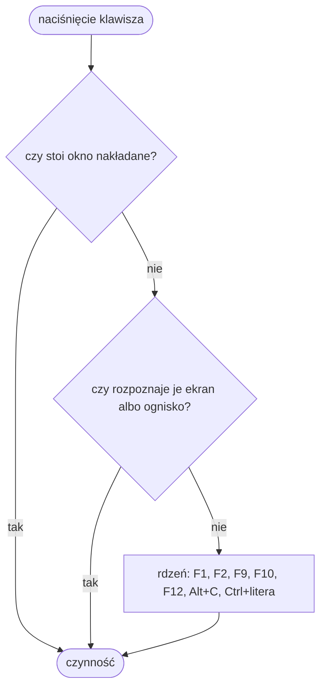
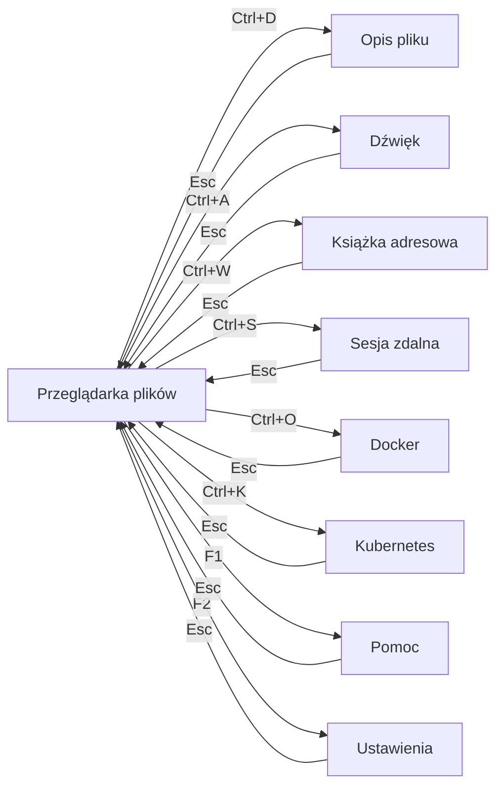

# 3. Ekran i sterowanie

> Podręcznik użytkownika, część 3 z 7. [Spis](README.md) ·
> [English](../../en/manual/03-screen-and-controls.md)

## Ognisko — kto dostaje klawisz

W każdej chwili dokładnie jedno miejsce ma **ognisko**: panel, pole tekstowe,
drzewo albo lista. To ono dostaje klawisz jako pierwsze, i to jego klawisze
stoją na początku paska stanu. Miejsce z ogniskiem poznaje się po **akcencie
w obwódce**.

Klawisz wędruje trzema piętrami i zatrzymuje się na pierwszym, które go
rozpozna: najpierw **okno nakładane**, jeśli jakieś stoi na wierzchu (jest
modalne — nic pod nim klawisza nie zobaczy), potem **ekran** wraz z miejscem
mającym ognisko, a na końcu **rdzeń**, czyli klawisze działające wszędzie.
Dlatego `Esc` znaczy co innego w pytaniu (odmowa), co innego w polu filtra
(zdjęcie filtra), a co innego na liście plików (powrót do modułu domyślnego).

## Pasek stanu jest ściągawką

Pasek u dołu mówi o **miejscu, na którym stoi ognisko**: najpierw jego nazwa
i klawisze (`Panel lewy: ↑↓ zaznaczenie · Enter katalog · Backspace wyżej`),
potem klawisze całego ekranu, a na końcu te globalne wraz ze skrótami modułów.

Przeniesienie ogniska zmienia pasek **w tej samej klatce**. Przy zbyt wąskim
oknie pozycje ustępują od końca — pierwsze znikają klawisze globalne, ostatni
`F1`, bo bez niego znika droga do pełnego spisu. Gdy podpowiedzi nie mieszczą
się w wierszu, pasek rośnie do dwóch, ale nigdy nie zasłania komunikatu i nigdy
nie urywa pozycji w połowie słowa.

**Pasek pokazuje wyłącznie to, co działa tu i teraz.** Klawisz warunkowy —
na przykład `Esc` zdejmujący filtr — pojawia się dopiero wtedy, gdy jest co
zdjąć. Spis niżej oznacza takie klawisze słowem „gdy".

Pełny spis klawiszy jest zawsze pod **`F1`** i nie jest tam przepisany ręcznie:
pochodzi z tych samych wiązań, które klawisze obsługują.

## Mapa ekranów

Widoczny ekran jest zawsze **jeden**, a wraca się z niego klawiszem `Esc` do
modułu domyślnego (fabrycznie: przeglądarki plików). Okno komend, menu i okna
pytań stają **nad** ekranem i nie zastępują go.

Skrót modułu działa **z każdego ekranu**, nie tylko z przeglądarki — strzałki
na rysunku wychodzą z niej dlatego, że to ona jest miejscem startowym.

## Spis klawiszy

Spis jest **pogrupowany wedle miejsca**, dokładnie tak, jak grupuje je pasek
stanu i okno `F1` — inaczej porównanie jednego z drugim pokazywałoby dwa różne
układy tej samej wiedzy. Nazwa miejsca stoi w nagłówku, a wiersz mówi klawisz
i czynność.

### Wszędzie

<!-- spis:klawisze:globalne -->
| Klawisz | Co robi |
|---|---|
| `F1` | pomoc |
| `F2` | ustawienia |
| `F9` | menu kontekstowe |
| `F10` | wyjście |
| `F11` | pełny ekran — **tylko w trybie okienkowym** |
| `F12` | okno komend |
| `Alt`+`C` | skopiuj do schowka |
<!-- /spis -->

### Skróty modułów

<!-- spis:klawisze:moduly -->
| Klawisz | Co robi |
|---|---|
| `Ctrl`+`B` | Przeglądarka plików |
| `Ctrl`+`D` | Opis pliku |
| `Ctrl`+`A` | Dźwięk |
| `Ctrl`+`S` | Sesja zdalna |
| `Ctrl`+`O` | Docker |
| `Ctrl`+`K` | Kubernetes |
| `Ctrl`+`W` | Książka adresowa |
<!-- /spis -->

### Lista plików

<!-- spis:klawisze:lista-plikow -->
| Klawisz | Co robi |
|---|---|
| `↑` / `↓` | zmiana zaznaczenia |
| `Enter` / `→` | wejście do katalogu |
| `Backspace` / `←` | katalog wyżej |
| `Space` | zaznaczenie wpisu i przejście niżej |
| `Shift`+`↑` / `Shift`+`↓` | zaznaczanie zakresem |
| `*` | odwrócenie zaznaczenia na widocznej liście |
| `.` | pokaż lub ukryj wpisy ukryte |
| `/` | zawężenie listy fragmentem nazwy |
| `Ctrl`+`T` | panel jako drzewo albo lista |
| `Tab` | przejście do drugiego panelu — **gdy** podział jest włączony |
| `F3` | stos cofnięć |
| `F4` | zmiana nazwy wpisu |
| `F5` | kopiowanie wpisu |
| `F6` | przeniesienie wpisu |
| `F7` | nowy katalog |
| `F8` / `Del` | przeniesienie wpisu do kosza |
| `Shift`+`F8` / `Shift`+`Del` | usunięcie trwałe wpisu |
| `Alt`+`U` | cofnięcie ostatniej operacji |
| `Esc` | zdjęcie filtra — **gdy** filtr jest założony |
| `Esc` | zdjęcie zaznaczenia — **gdy** filtra nie ma, a zaznaczenie jest |
<!-- /spis -->

`F8` i `Shift`+`F8` zamieniają się rolami, gdy wyłączysz pozycję „Usuwaj do
kosza": klawisz goły robi zawsze to, co mówi ustawienie, a `Shift` — zawsze to
drugie. Opis w pasku stanu idzie **za ustawieniem**, więc pokazuje to, co
klawisz naprawdę zrobi.

### Panel przełączony na drzewo

<!-- spis:klawisze:drzewo -->
| Klawisz | Co robi |
|---|---|
| `↑` / `↓` | zmiana zaznaczenia |
| `→` | rozwinięcie gałęzi |
| `←` | zwinięcie gałęzi lub poziom wyżej |
| `Enter` | wejście do katalogu |
| `Backspace` | katalog wyżej |
<!-- /spis -->

Pozostałe klawisze listy (`.`, `/`, `Ctrl`+`T`, `F4`–`F8`, `Alt`+`U`, `F3`)
działają tak samo. Zaznaczenia wielokrotnego drzewo **nie pokazuje i na nim nie
działa** — powrót do listy zastaje zbiór takim, jaki był.

### Pole filtra

<!-- spis:klawisze:filtr -->
| Klawisz | Co robi |
|---|---|
| `↑` / `↓` | zmiana zaznaczenia na zawężonej liście |
| `Enter` | zostaw listę zawężoną |
| `Esc` | zdejmij filtr i wróć do wpisu |
| `←` / `→` / `Home` / `End` | ruch karetki w wierszu |
| `Backspace` / `Del` | kasowanie znaku |
| `Alt`+`V` | wklej ze schowka |
<!-- /spis -->

### Stos cofnięć (`F3`)

<!-- spis:klawisze:cofniecia -->
| Klawisz | Co robi |
|---|---|
| `↑` / `↓` | wybór operacji |
| `Enter` | cofnięcie wybranej operacji |
| `Esc` | zamknięcie okna |
<!-- /spis -->

### Opis pliku

<!-- spis:klawisze:opis-pliku -->
| Klawisz | Co robi |
|---|---|
| `↑` / `↓` | zmiana zaznaczenia (sekcje) albo przewinięcie podglądu o linijkę |
| `Enter` | zwiń lub rozwiń sekcję |
| `Home` / `End` | pierwsza i ostatnia sekcja; w podglądzie — początek i koniec pliku |
| `PgUp` / `PgDn` | przewiń podgląd o panel |
| `Tab` | przejście między opisem a podglądem |
| `Alt`+`Z` | zawijanie wierszy w podglądzie |
| `s` | policz sumę kontrolną |
| `d` | policz zajętość katalogu |
| `Esc` | powrót do listy plików |
<!-- /spis -->

### Dźwięk — playlista

<!-- spis:klawisze:playlista -->
| Klawisz | Co robi |
|---|---|
| `↑` / `↓` | zmiana zaznaczenia |
| `Enter` | zagraj wskazany utwór — **gdy** playlista nie jest pusta |
| `Space` | zatrzymaj albo wznów — **gdy** playlista nie jest pusta |
| `F5` | dopisz wpis zaznaczony w przeglądarce |
| `F7` | dopisz utwór, wpisując ścieżkę |
| `F8` / `Del` | usuń pozycję z playlisty — **gdy** playlista nie jest pusta |
| `Shift`+`↑` / `Shift`+`↓` | przestaw pozycję w liście — **gdy** playlista nie jest pusta |
| `Tab` | przejdź do drugiego panelu (efekty) |
| `Esc` | powrót do listy plików |
<!-- /spis -->

### Dźwięk — efekty specjalne

<!-- spis:klawisze:efekty -->
| Klawisz | Co robi |
|---|---|
| `↑` / `↓` | zmiana zaznaczenia |
| `F5` | przypisz wpis zaznaczony w przeglądarce |
| `F7` | przypisz plik, wpisując ścieżkę |
| `Space` | wycisz albo włącz z powrotem — **gdy** zdarzenie ma plik |
| `F8` / `Del` | zabierz zdarzeniu plik — **gdy** zdarzenie ma plik |
<!-- /spis -->

### Książka adresowa

<!-- spis:klawisze:ksiazka -->
| Klawisz | Co robi |
|---|---|
| `↑` / `↓` | przejdź po wpisach |
| `←` / `→` | zmień rozdział |
| `Enter` / `F4` | zmień pola wpisu |
| `F6` | zmień kolumnę porządkującą |
| `F7` | dopisz wpis |
| `F8` | usuń wpis |
| `Ctrl`+`F` | zawęź spis |
<!-- /spis -->

### Sesja zdalna — spis hostów

<!-- spis:klawisze:hosty -->
| Klawisz | Co robi |
|---|---|
| `↑` / `↓` | wybór hosta |
| `Enter` | połącz albo rozłącz |
| `F5` | sprawdź stan sesji |
<!-- /spis -->

### Sesja zdalna — zdalny katalog

<!-- spis:klawisze:zdalny-katalog -->
| Klawisz | Co robi |
|---|---|
| `↑` / `↓` | zmiana zaznaczenia |
| `Enter` | wejdź do katalogu |
| `Backspace` | katalog wyżej |
| `F3` | zajrzyj do spisu hostów |
| `F5` | pobierz plik na tę maszynę |
| `F6` | wyślij zaznaczony plik lokalny |
| `Ctrl`+`R` | przeczytaj katalog na nowo |
| `Ctrl`+`H` | pokaż albo schowaj wpisy ukryte |
| `/` | zawęź listę nazwą |
| `Esc` | zdejmij filtr — **gdy** filtr jest założony |
<!-- /spis -->

### Docker — kontenery

<!-- spis:klawisze:docker-kontenery -->
| Klawisz | Co robi |
|---|---|
| `↑` / `↓` | zmiana zaznaczenia |
| `PgUp` / `PgDn` / `Home` / `End` | strona w górę lub w dół, początek i koniec |
| `Enter` | pokaż logi kontenera |
| `F3` | przejdź do obrazów |
| `F4` | uruchom albo zatrzymaj kontener |
| `Shift`+`F4` | zrestartuj kontener |
| `F5` | zawęź do projektu compose |
| `F7` | zbuduj obraz z katalogu |
| `F8` / `Del` | usuń kontener |
| `e` | pokaż spis środowisk |
| `r` | pokaż zawartość rejestru |
| `Ctrl`+`R` | odśwież listy |
<!-- /spis -->

### Docker — obrazy

<!-- spis:klawisze:docker-obrazy -->
| Klawisz | Co robi |
|---|---|
| `↑` / `↓` | zmiana zaznaczenia |
| `PgUp` / `PgDn` / `Home` / `End` | strona w górę lub w dół, początek i koniec |
| `F3` | wróć do kontenerów |
| `F7` | zbuduj obraz z katalogu |
| `F8` / `Del` | usuń obraz |
| `e` | pokaż spis środowisk |
| `r` | pokaż zawartość rejestru |
| `Ctrl`+`R` | odśwież listy |
<!-- /spis -->

### Docker — logi

<!-- spis:klawisze:docker-logi -->
| Klawisz | Co robi |
|---|---|
| `↑` / `↓` | przewijanie |
| `PgUp` / `PgDn` / `Home` | strona w górę lub w dół, początek |
| `End` | wróć na koniec logu |
| `Esc` / `F3` | wróć do listy kontenerów |
<!-- /spis -->

### Docker — środowiska (`e`)

<!-- spis:klawisze:docker-srodowiska -->
| Klawisz | Co robi |
|---|---|
| `↑` / `↓` | zmiana zaznaczenia |
| `Enter` | wybierz środowisko bieżące |
| `Ctrl`+`R` | odśwież konteksty klienta |
| `Esc` | wróć do listy kontenerów |
<!-- /spis -->

### Docker — rejestr obrazów (`r`)

<!-- spis:klawisze:docker-rejestr -->
| Klawisz | Co robi |
|---|---|
| `↑` / `↓` | zmiana zaznaczenia |
| `Enter` | pokaż etykiety obrazu |
| `F7` | podaj nazwę obrazu |
| `Ctrl`+`R` | pobierz ponownie |
| `Esc` | wróć do listy kontenerów |
<!-- /spis -->

### Kubernetes — drzewo zasobów i opis

<!-- spis:klawisze:k8s-zasoby -->
| Klawisz | Co robi |
|---|---|
| `↑` / `↓` | zmiana zaznaczenia |
| `PgUp` / `PgDn` / `Home` / `End` | strona w górę lub w dół, początek i koniec |
| `Enter` | rozwiń lub zwiń gałąź; w opisie — otwórz zasób |
| `Tab` | przejdź między drzewem a treścią |
| `c` | spis klastrów |
| `k` | zmień kontekst w tym pliku |
| `n` | zmień przestrzeń nazw |
| `y` | pokaż surowy YAML |
| `l` | logi poda |
| `x` | odsłoń wartość sekretu |
| `e` | zmień sekret |
| `F5` | zastosuj plik |
| `F8` / `Del` | usuń zasób |
| `Ctrl`+`R` | odśwież spis i listę |
<!-- /spis -->

### Kubernetes — logi poda (`l`)

<!-- spis:klawisze:k8s-logi -->
| Klawisz | Co robi |
|---|---|
| `↑` / `↓` | przewijanie |
| `PgUp` / `PgDn` / `Home` | strona w górę lub w dół, początek |
| `End` | wróć na koniec logu |
| `Esc` | zamknij logi |
<!-- /spis -->

### Kubernetes — spis klastrów (`c`)

<!-- spis:klawisze:k8s-klastry -->
| Klawisz | Co robi |
|---|---|
| `↑` / `↓` | zmiana zaznaczenia |
| `Enter` | wybierz klaster |
| `Ctrl`+`R` | przeczytaj pliki od nowa |
| `Esc` | zamknij spis |
<!-- /spis -->

### Kubernetes — klaster nieosiągalny

<!-- spis:klawisze:k8s-nieosiagalny -->
| Klawisz | Co robi |
|---|---|
| `c` | spis klastrów |
| `k` | zmień kontekst w tym pliku |
| `Enter` / `F5` | spytaj klaster jeszcze raz |
<!-- /spis -->

### Ustawienia

<!-- spis:klawisze:ustawienia -->
| Klawisz | Co robi |
|---|---|
| `↑` / `↓` | zmiana zaznaczenia |
| `PgUp` / `PgDn` / `Home` / `End` | strona w górę lub w dół, początek i koniec |
| `←` / `→` / `Enter` | na pasku zakładek: zmiana zakładki; na pozycji: zmiana wartości |
| `Enter` | edycja wartości — **gdy** pozycja jest tekstowa |
| `Enter` | przywróć ustawienia domyślne — **gdy** kursor stoi na przycisku |
| `Esc` | powrót do listy plików |
<!-- /spis -->

W trakcie edycji wartości tekstowej `Enter` **zatwierdza**, a `Esc` **porzuca
zmianę** — nie zamyka ekranu; mówi o tym samo wiązanie w pasku stanu.

### Pomoc (`F1`)

<!-- spis:klawisze:pomoc -->
| Klawisz | Co robi |
|---|---|
| `↑` / `↓` | przewijanie |
| `←` / `→` | zmiana zakładki |
| `Enter` | zwiń lub rozwiń sekcję |
| `Esc` | powrót do listy plików |
<!-- /spis -->

### Okno komend (`F12`)

<!-- spis:klawisze:okno-komend -->
| Klawisz | Co robi |
|---|---|
| *znaki* | wpisywanie nazwy; lista filtruje się w locie |
| `Tab` | uzupełnij nazwę; przy pustym wierszu — przełącz na kwerendy i z powrotem |
| `↑` / `↓` | wybór z listy |
| `Enter` | uruchom komendę |
| `←` / `→` / `Home` / `End` | ruch karetki w wierszu |
| `Backspace` / `Del` | kasowanie znaku |
| `Alt`+`V` | wklej ze schowka |
| `Esc` | zamknij okno |
<!-- /spis -->

### Menu kontekstowe (`F9`)

<!-- spis:klawisze:menu -->
| Klawisz | Co robi |
|---|---|
| `↑` / `↓` | wybór z listy |
| `Enter` | wykonaj działanie |
| `Esc` | zamknij menu |
<!-- /spis -->

### Okna pytań

Cztery rodzaje okien nakładanych, wszystkie modalne — kliknięcie poza nimi nic
nie robi i ich nie zamyka.

**Pytanie tak/nie**

<!-- spis:klawisze:pytanie -->
| Klawisz | Co robi |
|---|---|
| `←` / `→` / `Tab` | zmień odpowiedź |
| `Enter` | potwierdź |
| `Esc` | odmów |
<!-- /spis -->

**Wybór z kilku**

<!-- spis:klawisze:wybor -->
| Klawisz | Co robi |
|---|---|
| `↑` / `↓` | wybór z listy |
| `Enter` | odpowiedz |
| `Esc` | wycofaj się |
<!-- /spis -->

**Wpisanie tekstu**

<!-- spis:klawisze:wpisanie -->
| Klawisz | Co robi |
|---|---|
| `Enter` | zatwierdź wpisaną nazwę |
| `Esc` | porzuć wpisywanie |
| `←` / `→` / `Home` / `End` | ruch karetki w wierszu |
| `Backspace` / `Del` | kasowanie znaku |
| `Alt`+`V` | wklej ze schowka |
<!-- /spis -->

**Postęp pracy**

<!-- spis:klawisze:postep -->
| Klawisz | Co robi |
|---|---|
| `Esc` | przerwij pracę |
<!-- /spis -->

W pytaniu groźnym — usunięcie trwałe, przywrócenie ustawień domyślnych, nieznany
klucz hosta — ognisko startuje **na odmowie**, więc przytrzymany `Enter` trafia
w „nie".

## Mysz

Aplikacja przyjmuje wskaźnik we **wszystkich trzech torach**, i zachowanie jest
wszędzie takie samo:

| Czynność | Skutek |
|---|---|
| Kliknięcie w wiersz listy | kursor staje na wskazanej pozycji |
| Kliknięcie w drugi panel | ognisko przechodzi na ten panel **i** kursor staje |
| Podwójne kliknięcie | to, co `Enter` w tym miejscu (próg 400 ms, ta sama komórka) |
| Środkowy przycisk | zaznaczenie wpisu — to, co spacja, ale bez kroku w dół |
| Prawy przycisk | menu kontekstowe, po uprzednim postawieniu kursora |
| Kółko | przewinięcie o trzy wiersze, **bez ruszania kursora** |
| Przeciągnięcie granicy paneli | zmiana proporcji podziału; zapisuje się w ustawieniach |
| Przeciągnięcie po treści | zaznaczenie prostokąta do skopiowania |
| Kliknięcie w podpowiedź stopki | to samo, co jej klawisz |
| Kliknięcie w zakładkę | przejście na tę zakładkę |

Mysz da się **wyłączyć** — `F2`, zakładka „Wygląd", pozycja „Mysz". Działa od
razu i przywraca natywne zaznaczanie terminala. Przy włączonej myszy natywne
zaznaczanie zostaje osiągalne pod `Shift`em, tak jak w każdym emulatorze.

## Schowek

`Alt`+`C` kopiuje, `Alt`+`V` wkleja — w terminalu i w oknie, także po drugiej
stronie połączenia SSH.

**Kopiowane jest jedno z trzech, w tej kolejności:**

1. **treść zaznaczona myszą** — prostokąt narysowany po klatce; aplikacja wie,
   co pod nim pisze, także tam, gdzie obraz jest bitmapą;
2. **ścieżki wpisów zaznaczonych** spacją — po jednej w wierszu, ze ścieżką,
   a nie samą nazwą, żeby dały się użyć po wklejeniu;
3. **ścieżka wpisu pod kursorem**, gdy nie ma ani zaznaczenia, ani zbioru.

Pasek stanu mówi, **co** skopiowano, a nie „skopiowano" — po tym samym klawiszu
trzy różne treści byłyby nierozróżnialne. Skopiować da się także treść okna
nakładanego: `Alt`+`C` w pytaniu o nieznany klucz hosta bierze odcisk
`SHA256:…`, a w oknie kwerend — całą odpowiedź.

**Wklejanie ma jedno miejsce docelowe: pole tekstowe z ogniskiem.** `Alt`+`V`
nad listą plików mówi, że nie ma gdzie wkleić, i **nie pyta terminala** o
zawartość schowka. Treść wielowierszowa wchodzi do pola jednowierszowego
z nowymi liniami zamienionymi na odstępy.

Kopiowanie w terminalu jest jednostronne — potwierdzenia nie ma i mieć nie
może — więc treść dłuższa niż 64 kB kończy się **odmową ze zdaniem**, zamiast
cichym obcięciem w połowie.

Gdy `Alt`+`C` albo `Alt`+`V` nie działa, zajrzyj do
[rozdziału 2](02-instalacja.md), „Gdy coś nie działa".

## Dokąd dalej

- [4. Praca z plikami](04-praca-z-plikami.md) — co tymi klawiszami zrobić
- [5. Moduły](05-moduly.md) — siedem okien i co w nich jest
