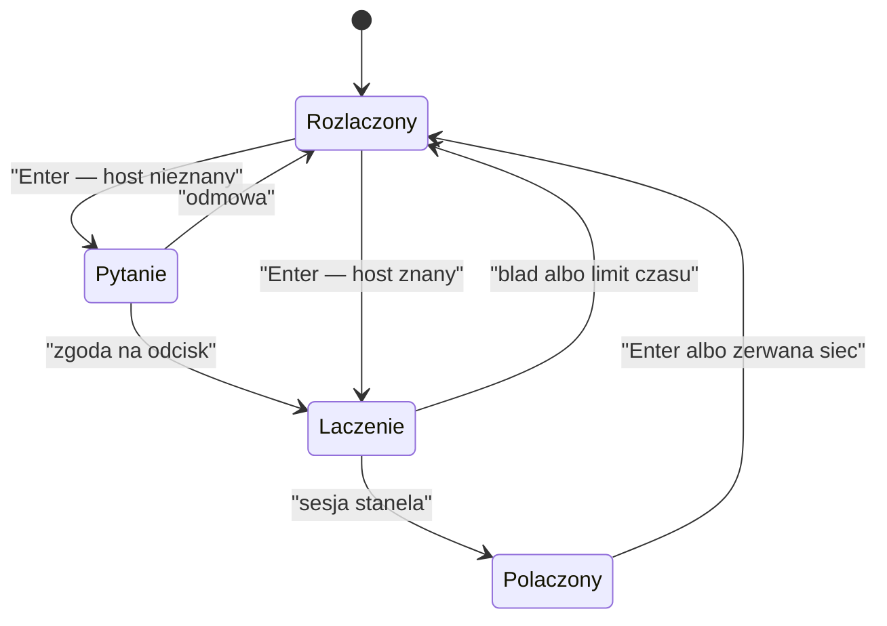

# 5. Moduły

> Podręcznik użytkownika, część 5 z 7. [Spis](README.md) ·
> [English](../../en/manual/05-modules.md)

Wszystko poza pętlą, klatką i oknami jest **modułem**. Moduł ma własne okno pod
`Ctrl`+literą, własną zakładkę w ustawieniach, własną zakładkę w pomocy (`F1`)
i własne komendy z przedrostkiem swojego identyfikatora.

**Moduł, którego maszyna nie udźwignie, znika ze spisu wraz z powodem** —
i to jest zachowanie normalne, nie awaria. Powód widać w pasku stanu przy
starcie i na zakładce „Moduły" w ustawieniach.

<!-- spis:moduly -->
| Moduł | Skrót | Wymaga | Bez tego |
|---|---|---|---|
| Przeglądarka plików | `Ctrl`+`B` | — | nie da się jej wyłączyć |
| Opis pliku | `Ctrl`+`D` | — (`file`, `du` opcjonalnie) | części opisu brak |
| Dźwięk | `Ctrl`+`A` | rozszerzenie `glfw` | komendy odpowiadają zdaniem o niedostępności |
| Książka adresowa | `Ctrl`+`W` | — | — |
| Sesja zdalna | `Ctrl`+`S` | klient OpenSSH | modułu nie ma na liście |
| Docker | `Ctrl`+`O` | rozszerzenie `curl` | modułu nie ma na liście |
| Kubernetes | `Ctrl`+`K` | `kubectl` | moduł jest, ale nie ma z kim rozmawiać |
<!-- /spis -->

## Przeglądarka plików (`browser`, `Ctrl`+`B`)

Sam menadżer plików: lista albo drzewo, filtr, zaznaczenie wielokrotne, pięć
operacji na dysku, kosz i cofanie. Opisuje ją w całości
[rozdział 4](04-praca-z-plikami.md).

Jedno, co warto wiedzieć tutaj: **przeglądarka jest modułem ostatniej szansy**.
Nie da się jej wyłączyć ani odrzucić, a `Esc` wraca do niej z każdego innego
ekranu. Aplikacja wraca do niej także wtedy, gdy moduł ustawiony jako startowy
jest wyłączony, został odrzucony, nie ma go na liście albo nie wnosi okna —
i za każdym razem powód widać w pasku stanu, bo każdy prowadzi do innej
poprawki.

Komenda **`browser.jump <ścieżka>`** podpowiada katalogi z dysku; `Tab`
uzupełnia ścieżkę, a ścieżka względna liczy się od bieżącego miejsca.

## Opis pliku (`file-info`, `Ctrl`+`D`)

**Pełny obraz stanu zaznaczonego wpisu**, także katalogu: cztery zwijane sekcje
po lewej, a po prawej miniatura albo **treść pliku tekstowego**.

| Sekcja | Co pokazuje |
|---|---|
| Tożsamość | nazwa, rodzaj z `lstat`, opis od polecenia `file`, cel dowiązania wraz z informacją, czy istnieje, liczba wpisów katalogu |
| Rozmiar | rozmiar w jednostkach i co do bajta, bloki i-węzła, zajętość katalogu (`du`), suma kontrolna `sha256` |
| Uprawnienia | prawa `rwx` i ósemkowo, właściciel, grupa, opcjonalnie i-węzeł i liczba dowiązań |
| Czasy | zmiana treści, zmiana i-węzła, odczyt — datą albo jako „ile temu" |

**Suma kontrolna liczy się dopiero po naciśnięciu `s`**, a zajętość katalogu po
naciśnięciu `d` — i obie są domyślnie wyłączone. Powód jest ten sam: pierwsza
czyta cały plik, druga przechodzi całe drzewo, więc żadna nie ma prawa startować
sama przy przewijaniu listy. Liczą się **po kawałku, w tle**; pętla nie czeka
ani chwili, a po zamknięciu aplikacji nie zostaje ani jeden proces.

**Prawy panel pokazuje treść pliku tekstowego.** `Tab` przenosi kursor między
opisem a podglądem; w podglądzie strzałki przewijają o linijkę, `PgUp`/`PgDn`
o panel, `Home` wraca na początek, `End` skacze na koniec, a `Alt`+`Z` przełącza
zawijanie.

Trzy rzeczy, które w tym podglądzie zaskakują, a są zamierzone:

- **linijka to linijka panelu, nie wiersz pliku** — przy zawijaniu plik będący
  jedną długą linią przewija się o wiersz ekranu, a `PgDn` o tyle linijek, ile
  było widać;
- **po `End` numery wierszy znikają** — kotwica staje wtedy po bajcie, a numeru
  z bajtu nie da się wyczytać bez przejścia całego pliku; `Home` je przywraca;
- **czytany jest wyłącznie widoczny fragment**, więc plik półgigabajtowy otwiera
  się tak samo szybko, jak kilobajtowy.

Czy plik jest tekstem, rozstrzyga kaskada: rozszerzenie, opis od `file`, a na
końcu podejrzenie pierwszych bajtów — dzięki temu `README` i `.gitignore` też
mają podgląd. Kodowanie rozpoznajemy z nagłówka i konwertujemy do UTF-8, także
UTF-16 i UTF-32. Podgląd binariów nie powstaje i mówi o tym wprost.

## Dźwięk (`audio`, `Ctrl`+`A`)

Muzyka grająca **obok** pracy z plikami. Okno ma dwa panele — playlistę
i przypisania dźwięków do zdarzeń — a `Tab` przechodzi między nimi.

`Enter` gra wskazany utwór, spacja zatrzymuje i wznawia (silnik **pauzuje**,
więc wznowienie wraca w to samo miejsce). Utwory dopisujesz trzema drogami:
**`F5`** bierze wpis zaznaczony w przeglądarce, **`F7`** pyta o ścieżkę,
a komenda **`audio.add <ścieżka>`** działa także wtedy, gdy okna nie widać.
`F8` usuwa pozycję, `Shift`+strzałki przestawiają ją w liście.

Formaty to **WAV, MP3 i FLAC** — plik MIDI się nie nada i mówi o tym wprost, bo
silnik odtwarza próbki, a nie zapis nutowy.

**Gdy utwór się skończy, następny rusza sam** — także wtedy, gdy dawno wróciłeś
do plików. Co się wtedy dzieje, rozstrzyga pozycja „Po utworze": pętla listy gra
dalej, „zatrzymaj" milknie, „powtarzaj utwór" gra ten sam w kółko. Pozycja
wskazująca plik, którego nie ma, **zostaje na liście** wyszarzona i podpisana —
playlista ją pomija, ale odpięty nośnik jej nie kasuje.

**Zdarzenia aplikacji mogą dostać dźwięk.** Lewy panel (`Tab`) pokazuje spis
wszystkich zdarzeń, jakie aplikacja ogłasza: pięć rdzenia (komunikat udany,
ostrzeżenie, błąd, otwarcie okna, wykonanie komendy) i siedemnaście
przeglądarki. Przypisania robisz tymi samymi klawiszami, co w playliście, a
**spacja wycisza przypisanie bez zabierania go**. Spoza okna działa komenda
`audio.hook <zdarzenie> <ścieżka>`. Przykładowe próbki leżą w `assets/sfx/`;
przy pierwszym uruchomieniu nic nie jest przypisane, więc aplikacja milczy,
dopóki jej nie poprosisz.

Efekt gra **na muzyce**, własną głośnością i nie przerywa utworu. Trzymana
strzałka nie zamienia kliku w warkot — to samo zdarzenie milczy przez chwilę po
zagraniu.

Playlista mieszka w `~/.light-manager/audio.json`; plik ruszony ręcznie daje
pustą listę wraz z komunikatem, nigdy błędu przy starcie.

## Książka adresowa (`address-book`, `Ctrl`+`W`)

**Wspólny spis miejsc**, do których łączą się pozostałe moduły. Zakładki u góry
to **rozdziały**: „Wszystkie" pokazuje wpisy z identyfikatorami, a każda
następna — kolumny jednego rozdziału, wzięte wprost z tego, co zadeklarował
moduł, który go używa.

`F7` dopisuje wpis, `F4` (albo `Enter`) prowadzi łańcuchem okien po polach
bieżącej zakładki, `F8` usuwa, `F6` przestawia kolumnę porządkującą,
a `Ctrl`+`F` zawęża spis. To samo robią komendy `address-book.add`,
`address-book.set`, `address-book.rename`, `address-book.remove`
i `address-book.forget`.

Trzy rzeczy warto o niej wiedzieć:

1. **Wpis ma nazwę i identyfikator**, a tożsamością jest identyfikator — nazwę
   wolno zmienić, powtórzyć albo zostawić pustą, a odniesienia innych modułów
   tego nie zauważą.
2. **Pola przy wpisie dokładają moduły.** Sesja zdalna dopisuje adres, port,
   użytkownika i sposób uwierzytelnienia; Docker — rodzaj połączenia z demonem;
   Kubernetes — plik `kubeconfig` i kontekst. **Jeden wpis może nieść wszystkie
   trzy naraz** i wtedy adres poprawia się w jednym miejscu, a nie w trzech.
3. **Rozdział nie jest niczyj** — każdy moduł czyta i zmienia wszystkie
   rozdziały tymi samymi komendami. Pola oznaczone jako sekret są na ekranie
   zasłonięte; plik stanu ma prawa `0600`, ale **szyfrowania nie ma i nie
   udaje**.

Spisy ze starszych wersji — hosty SSH, środowiska Dockera i klastry Kubernetesa
— **przenoszą się do książki same**, przy pierwszym uruchomieniu; stary zapis
zostaje na dysku nietknięty.

## Sesja zdalna (`ssh`, `Ctrl`+`S`)

Połączenie SSH z hostem z książki adresowej. `Enter` łączy z podświetlonym
wpisem albo rozłącza, `F5` sprawdza stan sesji. **Adres, login i sposób
uwierzytelnienia zmienia się w książce** (`Ctrl`+`W`, zakładka „Sesja zdalna"),
a nie tutaj — ten sam wpis widzi także Docker, gdy podnosi tunel.

Połączenie przechodzi przez cztery stany i tylko jeden z nich pyta o cokolwiek:
host o **nieznanym odcisku** zatrzymuje połączenie pytaniem — oknem groźnym,
tym samym, którym usuwa się trwale, z odciskiem `SHA256:…` pokazanym w całości.
Po zgodzie wiersz do `~/.ssh/known_hosts` dopisuje **sam klient `ssh`**;
aplikacja tego pliku nie zapisuje ani razu. Klucz **niezgodny** z zapamiętanym
to nie pytanie, tylko odmowa.

Uwierzytelnienie idzie przez agenta (domyślnie), klucz z pliku albo hasło.
**Hasła nie są nigdzie zapisywane** — pytanie pada przy każdym połączeniu,
w polu, które nie pokazuje wpisywanej treści.

Sesja żyje w **procesie potomnym**, nie w procesie aplikacji, więc nic
sieciowego nie dzieje się w środku rysowania klatki, a host nieosiągalny kończy
się komunikatem w czasie z ustawienia, a nie zawieszeniem. Stan sesji **nie
odświeża się sam** — kosztuje osobny proces — od tego jest `F5`. Sesja zerwana
przez sieć bywa więc przez chwilę pokazana jako żywa.

**Po połączeniu ekran pokazuje zdalny katalog**, w tych samych kolumnach, co
lista lokalna. `Enter` wchodzi, `Backspace` wraca wyżej, `Ctrl`+`R` czyta na
nowo, `/` zawęża listę, `Ctrl`+`H` przełącza wpisy ukryte, a `F3` zagląda
z powrotem do spisu hostów. Ostatni katalog pamięta się **osobno dla każdego
wpisu** i przeżywa ponowne uruchomienie.

Katalog czyta się **jednym wywołaniem `sftp`**, poza rysowaniem klatki — lista
pojawia się po chwili, a aplikacja przez ten czas odpowiada normalnie. Wpisy
ukryte kosztują **nowy odczyt**, a nie przefiltrowanie tego, co przyszło: serwer
bez wyraźnej prośby po prostu ich nie przysyła.

**Pliki przenosi się w obie strony**: `F5` pobiera wpis zdalny do katalogu,
w którym stoi przeglądarka, `F6` wysyła zaznaczony plik lokalny. Obie czynności
mają komendy (`ssh.get`, `ssh.put`) i pozycje w menu `F9`. Zajęta nazwa w celu
**zatrzymuje pracę pytaniem**, a `Esc` przerywa.

Przerwanie **nie zostawia pliku wyglądającego na gotowy**: treść ląduje pod
nazwą roboczą (`.nazwa.lm-part`) i dopiero po całości dostaje nazwę docelową,
a połówka znika po obu stronach — także wtedy, gdy to sieć zerwała się w środku.
**Przesyłane są pliki, nie katalogi**, a przesył kopiuje — źródła nie usuwa.

## Docker (`docker`, `Ctrl`+`O`)

Kontenery i obrazy **wybranego środowiska**, logi na żywo, budowa obrazów,
projekty compose i rejestry.

`Ctrl`+`O` otwiera listę kontenerów, `F3` przełącza na obrazy. Listy pochodzą
wprost od demona i **odświeżają się co kilka sekund, dopóki ten ekran jest
widoczny**; `Ctrl`+`R` odświeża natychmiast, a po własnej czynności dzieje się
to samo z siebie.

`F4` uruchamia albo zatrzymuje kontener — zależnie od jego stanu, `Shift`+`F4`
restartuje, `F8` usuwa i pyta o zgodę. **`Enter` otwiera logi**; płyną na żywo
także wtedy, gdy patrzysz na co innego, strzałka w górę zatrzymuje widok, `End`
wraca na koniec.

`F7` **buduje obraz**: pyta o katalog z plikiem `Dockerfile`, potem o nazwę.
Kontekst pakowany jest z pominięciem tego, co wyklucza `.dockerignore`.

Komendy `docker.up` i `docker.down` podnoszą i kładą **projekt compose**; bez
argumentu biorą plik z katalogu, w którym stoi przeglądarka. `F5` zawęża listę
do projektu.

### Środowiska (`e`)

Litera **`e`** otwiera spis środowisk: gniazdo lokalne, konteksty klienta
`docker` (czytane, nigdy nie zmieniane) oraz wpisy własne — **tunel SSH**
i **demon po TCP z TLS**. `Enter` wybiera bieżące, a kontenery i obrazy zdalnego
demona widać wtedy w tych samych panelach, co lokalne; górny pas mówi, z kim
rozmawiasz.

Wpisy dopisuje się **w książce adresowej** (`Ctrl`+`W`, zakładka „Docker"), bo
to tam mieszkają:

- **tunel SSH** — rodzaj `tunel`, cel wybierany z listy wpisów (wskazuje wpis
  z wypełnioną zakładką „Sesja zdalna") i ścieżka gniazda po stronie zdalnej
  (domyślnie `/var/run/docker.sock`). Przy wyborze środowiska padnie pytanie,
  czy uwierzytelnić kluczem/agentem, czy hasłem — hasło nie jest nigdzie
  zapisywane;
- **TCP z TLS** — rodzaj `tcp`, adres i port (domyślnie 2376) oraz trzy ścieżki:
  certyfikat klienta, jego klucz i certyfikat urzędu. Dla compose komplet musi
  leżeć w jednym katalogu pod nazwami `cert.pem`/`key.pem`/`ca.pem`.

Tunel wstaje **na wybór**, nigdy przy starcie aplikacji, a po wyjściu
z aplikacji nie zostaje ani proces `ssh`, ani plik gniazda.

Brak gniazda lokalnego **nie zabiera modułu** — to stan środowiska, mówiony
zdaniem na ekranie. Moduł znika wyłącznie bez rozszerzenia `curl`.

### Rejestry obrazów (`r`)

Litera **`r`** otwiera zawartość rejestru: spis obrazów, a `Enter` — ich
etykiety. Rejestr, który spisu nie wystawia (tak robi większość publicznych),
poprosi zamiast tego o **nazwę obrazu** (`F7`). `Ctrl`+`R` pobiera — samo
wejście w widok niczego nie ściąga, bo pytanie idzie do cudzego serwera.

Rejestry dopisuje się w książce adresowej (zakładka „Rejestr obrazów"): adres
(`ghcr.io`, `localhost:5000`), użytkownik, **token** (pole zasłonięte), „bez
TLS" dla rejestru w sieci lokalnej i „domyślny", czyli ten proponowany przy
wypychaniu. Ten sam wpis może być naraz demonem Dockera i rejestrem —
rozdziały są dwa, wpis jeden.

**Token leży w pliku książki jawnie**, z prawami `0600`. Zasłonięcie na ekranie
chroni przed spojrzeniem, nie przed odczytem pliku.

`docker.push` pyta, **do którego** rejestru wypchnąć (przy jednym nie pyta),
a `docker.pull` pobiera obraz — poświadczenie dobiera po adresie zawartym
w jego nazwie.

## Kubernetes (`k8s`, `Ctrl`+`K`)

Zasoby klastra w drzewie: **grupy API, w nich rodzaje zasobów, w nich zasoby**.
Rodzaje pochodzą z klastra, więc zasoby własne (CRD) pojawiają się same.
Gałąź czyta się **dopiero przy rozwinięciu** — dopiero wtedy moduł pyta klaster
o listę.

`Enter` rozwija gałąź albo otwiera zasób, `Tab` przechodzi między drzewem
a treścią, `y` przełącza na **surowy YAML**, `l` otwiera **logi poda** (płyną na
żywo, `End` wraca na koniec).

`c` wybiera **klaster**, `n` zmienia **przestrzeń nazw**, `k` zmienia kontekst
w bieżącym pliku. Oba wybory są zapamiętywane, a **plik `kubeconfig` zostaje
nietknięty** — aplikacja do niego nie pisze.

`F5` **stosuje plik** (ścieżkę proponuje katalog przeglądarki), `F8` usuwa zasób
po potwierdzeniu, `Ctrl`+`R` odświeża spis i listę.

**Wartości sekretów są zamaskowane.** `x` odsłania jedną, `e` otwiera zmianę:
wartość tekstem lub base64, dodanie klucza, skasowanie klucza.

Nagłówek pokazuje **obie wersje**, gdy klient i serwer różnią się o więcej niż
jedno wydanie. Moduł nie odmawia wtedy niczego — Kubernetes nazywa to
niewspieranym, a nie niemożliwym.

**Wdrożenie obrazu z rejestru prywatnego** (`k8s.deploy-image`) **samo zakłada
sekret** w klastrze i dopina go do wdrożenia — bez ani jednego ręcznego
`kubectl create secret`. Sekret ma nazwę stałą dla rejestru
(`lm-registry-<nazwa>`), więc powtórzone wdrożenie ich nie mnoży, a dopięcie
**nie kasuje** sekretów, które wdrożenie już miało. Poświadczenie nie przechodzi
przez wiersz polecenia: idzie plikiem o prawach `0600`, kasowanym zaraz po
zastosowaniu — także wtedy, gdy się nie powiodło.

## Moduł otwierany przy starcie

Aplikacja startuje z oknem modułu wskazanego pozycją **„Moduł otwierany przy
starcie"** (zakładka „Moduły"); domyślnie jest to przeglądarka. Wskazanie innego
uruchamia aplikację z jego oknem jako dnem — tym, do którego wraca `Esc`.

Moduł da się **wyłączyć** na tej samej zakładce. Zmiana zapisuje się od razu,
ale działa **po ponownym uruchomieniu**: mapa skrótów i lista zakładek powstają
raz, przy starcie.

## Dokąd dalej

- [6. Ustawienia i konfiguracja](06-ustawienia.md) — co da się przestawić
- [7. Scenariusze](07-scenariusze.md) — moduły w działaniu, od początku do końca
