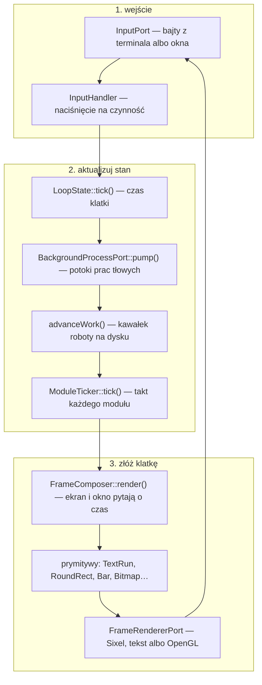
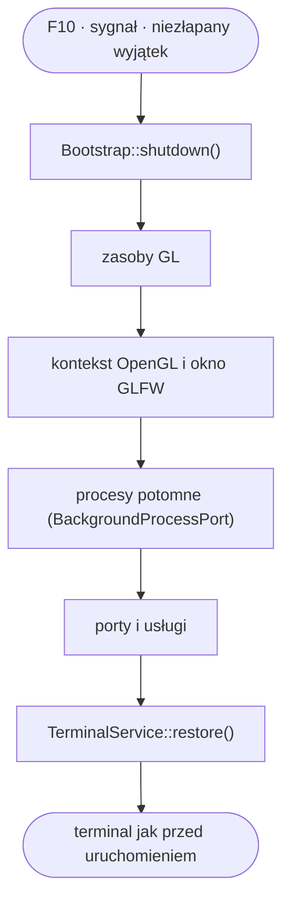

# 2. Cykl życia klatki

> Przewodnik dewelopera, część 2 z 8. [Spis](README.md) ·
> [English](../../en/guide/02-frame-cycle.md)

## Jedna droga od bajtu do piksela

Aplikacja jest **pętlą główną znaną z gier**: czyta wejście, aktualizuje stan,
składa całą klatkę i wypycha ją do terminala — trzydzieści razy na sekundę,
niezależnie od tego, czy cokolwiek się zmieniło. Nie ma tu przerysowań
częściowych, nie ma zdarzeń „odśwież ten fragment" i nie ma czekania na
wejście: klatka idzie i tak.

Takt dzieli się na **trzy fazy** i różnica między nimi jest tą jedną rzeczą,
którą nowy łamie najczęściej: wejście zamienia naciśnięcie na czynność, faza
stanu posuwa wszystko, co dzieje się samo — prace tłowe, kawałki roboty na
dysku, takty modułów — a dopiero na końcu `FrameComposer` **czyta** stan
i buduje z niego obraz. Rysowanie niczego nie zmienia.

## Co wolno robić w której fazie

| Faza | Wolno | Nie wolno |
|---|---|---|
| **Wejście** | zamienić naciśnięcie na czynność, zmienić stan, otworzyć okno | czekać na cokolwiek — pętla stoi |
| **Aktualizuj stan** | zmieniać dysk, posuwać pracę tłową, pytać moduły, gasić komunikaty | rysować |
| **Złóż klatkę** | czytać stan i budować prymitywy; pytać o czas klatki | **zmieniać cokolwiek** — ani stanu, ani dysku, ani ustawień |

**Reguła, którą nowy łamie najczęściej: praca zmieniająca dysk posuwa się
w `GameLoop`, a nie w `draw()`.** Kuszące jest dopisanie „jeszcze jednego
kroku kopiowania" tam, gdzie i tak liczysz, co narysować — a wtedy klatka
przestaje być funkcją stanu i zaczyna go zmieniać. Objaw: zmiana widoczna
zależy od tego, czy okno akurat było widoczne.

## Co żyje między klatkami

**Komponent jest bezstanowy i powstaje na nowo w każdej klatce.** Co ma
przeżyć — położenie okna listy, zwinięte sekcje, przewinięcie podglądu —
mieszka **obok** komponentu: w stanie ekranu, w module albo w `LoopState`,
i wchodzi do komponentu argumentem.

Skutek praktyczny: nie da się „zapamiętać czegoś w komponencie". Jeśli tego
potrzebujesz, potrzebujesz miejsca obok niego — i to jest właściwa odpowiedź,
a nie obejście.

## Trzy tory, jeden słownik

`FrameComposer` nie wie, w którym torze działa aplikacja. Buduje **prymitywy**
— siedem kształtów, słownik **zamknięty** — a dopiero renderer zamienia je
w Sixel, w bajty ANSI albo w wywołania OpenGL.

| Prymityw | Co to jest |
|---|---|
| `TextRun` | ciąg znaków w roli motywu |
| `TextMark` | napis na własnym tle — dopasowanie filtra, zaznaczenie treści |
| `RoundRect` | prostokąt z zaokrąglonymi rogami — oprawa paneli |
| `CornerBrackets` | nawiasy narożne — oprawa w palecie ubogiej |
| `Bar` | pasek: postęp, wypełnienie, przegroda |
| `Bitmap` | obraz — miniatura, podgląd |
| `Scrollbar` | suwak |

Liczbę sprawdza się jednym poleceniem, a nie pamięcią:
`grep -rl 'implements Primitive' src/`. Dokumentacja pomyliła się tu raz — krok
30 nazwał `TextMark` **ósmym** — i sprostowanie zajęło dwadzieścia sześć kroków.

**Słownik jest zamknięty i otwiera się go raz na kilkanaście kroków**, za zgodą
użytkownika — bo każdy nowy kształt to obowiązek dla **trzech** rendererów
naraz. Zanim go zaproponujesz, zobacz [rozdz. 4](04-zanim-dolozysz.md).

Pilnuje tego `PrimitiveTranslationTableTest`: prymityw bez tłumaczenia
w którymkolwiek torze przewraca bramkę.

## Praca dłuższa niż klatka

Nic, co trwa dłużej niż jedna klatka, nie ma prawa jej zatrzymać. Projekt ma na
to **dwie drogi** i różnica między nimi jest ostra:

| Droga | Kiedy | Gdzie się posuwa |
|---|---|---|
| **Praca kawałkowa** | robota jest twoja i da się ją pociąć (liczenie sumy kontrolnej, kopiowanie, usuwanie drzewa) | faza „aktualizuj stan", po jednym kawałku na klatkę |
| **Proces potomny** | robotę robi cudzy program (`ssh`, `sftp`, `kubectl`, `du`, `docker compose`) | `BackgroundProcessPort::pump()`, raz na klatkę |

Obie mają tę samą regułę końcową: **sprzątanie idzie dwiema drogami** — normalną
i awaryjną — bo proces potomny, którego nikt nie zabił, przeżyje aplikację.
Szczegóły: [rozdz. 3](03-jak-dodac.md), „Nowa praca tłowa”.

## Takt modułu

Moduł może poprosić o **jedno wywołanie na klatkę** (`NeedsTick`) —
**niezależnie od tego, co jest na wierzchu**. To jest cała różnica wobec
pytania o czas klatki: o czas pyta się to, co widać, a takt dostaje moduł, który
ma pracować także wtedy, gdy jego okna nie widać (playlista musi zauważyć, że
utwór się skończył).

Trzy reguły taktu, wszystkie z powodem:

- **takt ma być tani** — porównanie stanu, nigdy odczyt z dysku ani pytanie do
  sieci;
- **takt niczego nie wymusza** — o przerysowanie nie prosi, bo klatka i tak idzie;
- **moduł, który się w takcie wywróci, nie przerywa pętli**.

Pułapka, którą projekt już zapłacił: kwerenda o materiał uwierzytelnienia wołana
**co takt**, trzydzieści razy na sekundę. Zobacz [pułapkę 8](05-pulapki.md).

## Wyjście

Terminal wraca do stanu sprzed uruchomienia **trzema ścieżkami**: przez obsługę
sygnałów (SIGINT, SIGTERM, SIGHUP, SIGQUIT), przez funkcję zamknięcia procesu
(także przy niezłapanym wyjątku) i przez jawne `restore()`. Jedynym wyjątkiem
jest `SIGKILL`, którego przechwycić się nie da.

Kolejność sprzątania ma znaczenie i jest zapisana w `Bootstrap::shutdown()`:
zasoby GL idą **przed** kontekstem, procesy potomne przed portami, terminal na
końcu. Powód każdej z tych kolejności jest ten sam — **zwalniany zasób musi
jeszcze mieć kim być zwolniony**: tekstura oddana po zamknięciu kontekstu OpenGL
nie ma już do czego wrócić, a proces potomny ubity po zamknięciu portu zostawia
sierotę.

## Dokąd dalej

- [3. Jak dodać swoją rzecz](03-jak-dodac.md) — osiem przewodników
- [5. Pułapki](05-pulapki.md) — dziesięć rzeczy, które projekt już zapłacił
