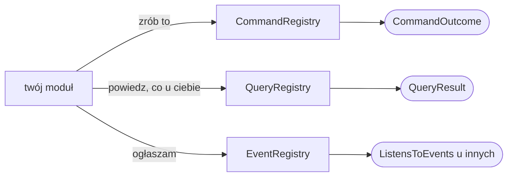
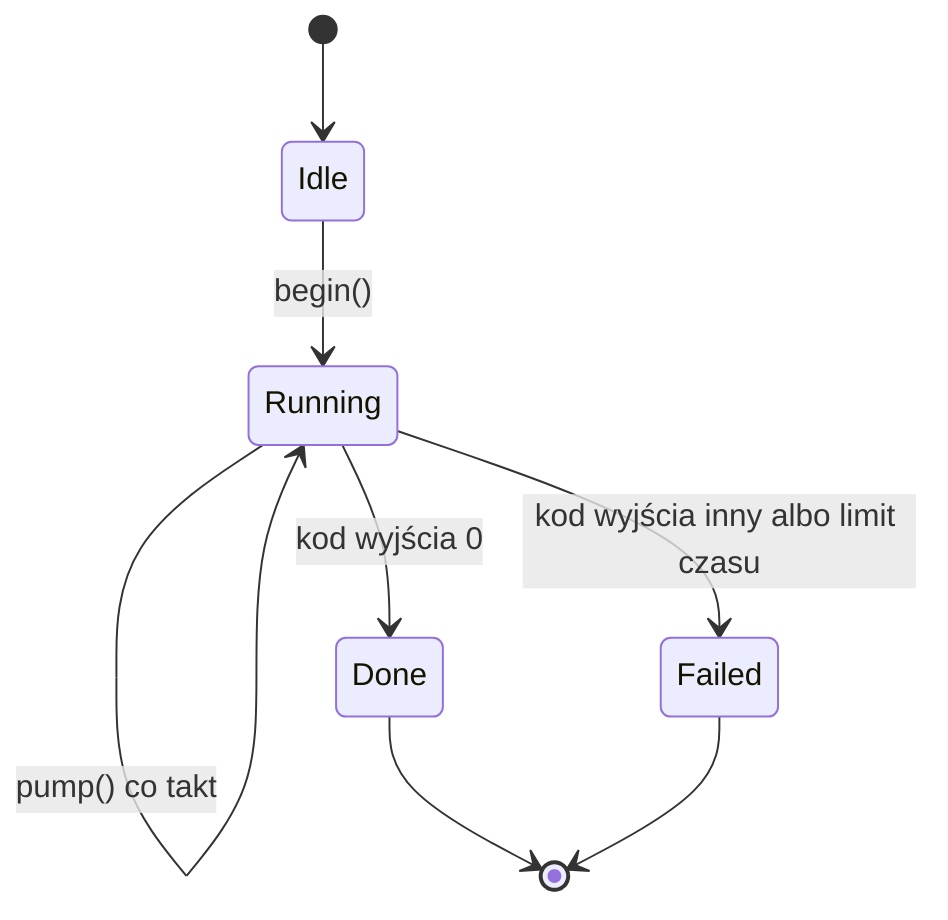

# 3. Jak dodać swoją rzecz

> Przewodnik dewelopera, część 3 z 8. [Spis](README.md) ·
> [English](../../en/guide/03-how-to-add.md)

Osiem przewodników, każdy w tym samym układzie: **kiedy tego użyć / kroki /
przykład / co sprawdzi bramka / czego nie robić**.

Zanim zaczniesz: jeśli twoja rzecz to **nowy prymityw** albo **zmiana
w rdzeniu zamiast modułu**, przeczytaj najpierw
[rozdz. 4](04-zanim-dolozysz.md) — tam odpowiedź prawie zawsze brzmi „nie”.

**Trzy rejestry, trzy pytania.** Rdzeń trzyma trzy spisy i to one są całą
rozmową modułu ze światem: `CommandRegistry` odpowiada na „zrób to" (nazwa
z przedrostkiem właściciela), `QueryRegistry` na „powiedz, co u ciebie"
(**jedyna droga odczytu danych**), a `EventRegistry` na „stało się coś, co może
kogoś obchodzić" (zamknięty słownik zdarzeń). Czwartej drogi nie ma — a to, co
wygląda na jej potrzebę, jest zwykle błędem w podziale na moduły.

---

## Nowy moduł

**Kiedy.** Zawsze, gdy dokładasz funkcję. **Nowa funkcja to moduł
w `src/Module/`, nie zmiana w rdzeniu** (reguła 15) — a to, że rdzeń trzeba by
tknąć, jest sygnałem błędu w projekcie modułu, nie powodem do wyjątku.

**Kroki.**

1. Wybierz **identyfikator** pasujący do `[a-z][a-z0-9-]*`. Jeden napis pełni
   trzy role: klucz w pliku konfiguracyjnym (`modules.<id>`), przedrostek
   napisów (`module.<id>.`) i przestrzeń nazw komend (`<id>.`).
2. Załóż `src/Module/<Nazwa>/` i powtórz w nim ten sam podział warstw, co
   w rdzeniu — **tylko te, których naprawdę potrzebujesz**.
3. Napisz klasę modułu w `Presentation/` z sufiksem `Module`. Zaimplementuj
   `ModuleInterface` — to jest **sama tożsamość**: `id()`, `nameKey()`,
   `descriptionKey()`, `shortcut()`, `translations()`.
4. **Dołóż zdolności, których potrzebujesz** — każda to osobny interfejs:

   | Zdolność | Gdzie leży | Co wnosi |
   |---|---|---|
   | `ProvidesCommands` | `Application/Module` | komendy w oknie `F12` |
   | `ProvidesQueries` | `Application/Module` | kwerendy |
   | `ProvidesSettingsTab` | `Application/Module` | zakładka ustawień |
   | `DeclaresEvents` | `Application/Module` | zdarzenia, które moduł ogłasza |
   | `ListensToEvents` | `Application/Module` | odbiór cudzych zdarzeń |
   | `NeedsTick` | `Application/Module` | takt raz na klatkę |
   | `RequiresEnvironment` | `Application/Module` | warunek środowiska; niespełniony **odrzuca moduł wraz z powodem** |
   | `ProvidesScreen` | `Presentation/Ui/Module` | ekran pod `Ctrl`+literą |
   | `ProvidesHelpTab` | `Presentation/Ui/Module` | własne wiersze w `F1` |
   | `ReadsContext` | `Presentation/Ui/Module` | ścieżka i zaznaczenie z sesji |

   Granicą warstwy jest **typ w sygnaturze**, nie przeczucie: zdolność
   wymieniająca typ z `Presentation` leży w `Presentation`.
5. Załóż `lang/pl.php` i `lang/en.php` z kluczami pod `module.<id>.`.
6. **Dopisz jedną linię do `Presentation/Cli/Bootstrap.php`.**

**Przykład.**
[`examples/modul-przykladowy/PrzykladModule.php`](../../../examples/modul-przykladowy/PrzykladModule.php),
wiersze 49–101 — moduł bez ekranu, wnoszący komendę, kwerendę i pozycję
ustawień. Ekran, zakładkę pomocy i takt pokazuje moduł prawdziwy:
[`src/Module/AddressBook/Presentation/AddressBookModule.php`](../../../src/Module/AddressBook/Presentation/AddressBookModule.php).

**Co sprawdzi bramka.** `NoModuleKnowsAnotherModuleTest` (żadnego `use` z cudzego
modułu), test katalogów napisów (klucz bez tłumaczenia i odwrotnie), a przy
skrócie — kolizja liter, którą `ModuleRegistry` odrzuca **wraz z całym modułem**,
nie tylko ze skrótem.

**Czego nie robić.**

- **Nie sięgaj do innego modułu.** Potrzebujesz jego danych → kwerenda. Chcesz,
  żeby coś zrobił → komenda. Chcesz wiedzieć, że coś się stało → zdarzenie.
- **Nie bierz litery zajętej przez terminal.** `c` i `z` są sygnałami, a `h`,
  `i`, `j` i `m` przychodzą tym samym bajtem, co `Backspace`, `Tab` i `Enter`.
  Zostaje dwadzieścia.
- **Nie licz na to, że moduł kosztuje więcej niż jedną linię w `Bootstrapie`.**
  Jeśli kosztuje — to jest błąd do naprawienia, nie cecha.

---

## Nowa komenda

**Kiedy.** Gdy czynność ma mieć nazwę: żeby dała się wywołać z `F12`, wejść do
menu `F9` i być powtarzalna z historii. Komenda jest też **jedyną drogą, którą
moduł prosi inny moduł o czynność**.

**Kroki.**

1. Klasa w `Presentation/Command/` swojego modułu (komendy rdzenia —
   `Presentation/Cli/Command/`), implementująca `CommandInterface`
   z `Application/Command`.
2. `name()` zaczyna się od identyfikatora właściciela. Przedrostka pilnuje
   `CommandRegistry`.
3. `descriptionKey()` oddaje **klucz katalogu**, nigdy napis.
4. `arguments()` **deklaruje** argumenty: nazwa, klucz etykiety, rodzaj,
   `required`, źródło podpowiedzi. Wiersz rozbiera jeden parser w rdzeniu.
5. `execute()` oddaje `CommandOutcome`: `done()`, `stay()`, `opens($screenId)`
   albo `quit()`.
6. Dodaj klasę do `commands()` swojego modułu.

**Przykład.**
[`examples/modul-przykladowy/Command/PowitanieCommand.php`](../../../examples/modul-przykladowy/Command/PowitanieCommand.php),
wiersze 35–82.

**Co sprawdzi bramka.** Rejestr odrzuci komendę z cudzym przedrostkiem;
`QueryCatalogueTest` i test katalogów napisów — brak opisu albo etykiety
argumentu w którymkolwiek języku.

**Czego nie robić.**

- **Nie otwieraj okna nakładanego identyfikatorem ekranu.** `CommandOutcome::opens()`
  służy do **ekranów**; okno nakładane przychodzi zdolnością `OpensOverlay`.
- **Nie rozbieraj wiersza sama.** Komenda dostaje `CommandInput` z gotowymi
  wartościami — inaczej każda tłumaczyłaby się użytkownikowi inaczej.
- **Nie zwracaj komunikatu jako napisu.** `Message` składa się z przetłumaczonego
  zdania i tonu.

---

## Nowa kwerenda

**Kiedy.** Gdy coś ma **oddawać dane** — twojemu ekranowi, cudzemu modułowi albo
człowiekowi w oknie `F12` po `Tab`ie. **Rejestr kwerend jest jedyną drogą
odczytu** i nie ma drugiej (reguła 11w).

**Kroki.**

1. Klasa w `Presentation/Query/` swojego modułu, implementująca
   `QueryInterface`.
2. `name()` z przedrostkiem właściciela, `descriptionKey()` kluczem.
3. `generation()` — **prawdziwy licznik zmian**, nie znacznik czasu. `Generation`
   bije go, gdy zmienia się to, co kwerenda oddaje; dzięki temu rejestr nie
   liczy odpowiedzi co klatkę.
4. `ask()` oddaje `QueryResult`:

   | Postać | Kiedy |
   |---|---|
   | `QueryResult::of($rows)` | wiersze gotowe od ręki |
   | `QueryResult::lazy($fn)` | wiersze kosztowne — składa je domknięcie dopiero przy pytaniu |
   | `QueryResult::owned($owner, $payload, $fn)` | właściciel dostaje typowany ładunek, reszta — wiersze |
   | `QueryResult::value($field, $value)` | jedna wartość |
   | `QueryResult::failed($problemKey)` | nie da się odpowiedzieć, i wiadomo dlaczego |

5. Dodaj klasę do `queries()` swojego modułu.

**Przykład.**
[`examples/modul-przykladowy/Query/StanQuery.php`](../../../examples/modul-przykladowy/Query/StanQuery.php),
wiersze 35–82.

**Co sprawdzi bramka.** `QueryIsTheOnlyReadPathTest` — czy nikt nie czyta danych
z pominięciem rejestru; `QueryCatalogueTest` — opis w obu katalogach oraz to, czy
mieści się w oknie.

**Czego nie robić.**

- **Nie zmieniaj niczego w `ask()`.** Kwerenda czyta. Zapis idzie komendą.
- **Nie oddawaj materiału uwierzytelnienia zwykłymi wierszami.** Poświadczenie
  ma osobną kwerendę, oznaczoną jako nietrzymana w pamięci rejestru.
- **Nie wołaj cudzej kwerendy co takt.** Zobacz [pułapkę 8](05-pulapki.md).
- **Nie odpowiadaj „nie wiem" ciszą.** Praca, która trwa, oddaje **stan pracy**,
  a nie pustą odpowiedź.

---

## Nowa pozycja ustawień

**Kiedy.** Gdy użytkownik ma coś przestawić i **ma to przeżyć restart**.

**Kroki.**

1. Dopisz `ModuleSetting` do deklaracji swojego modułu — rodzaj wybierasz
   z pięciu: `toggle()`, `choice()`, `number()`, `text()`, `secret()`.
2. Klucz etykiety: `module.<id>.setting.<klucz>`; napisy do obu katalogów.
3. Wartość czytaj przez `Settings::moduleValue()` i **nadaj odczytowi nazwane
   znaczenie** — metoda `mowiGlosno()` zamiast porównania z napisem rozsypanego
   po module.
4. `settingsTab()` oddaje `ModuleSettingsTab` z etykietą i listą pozycji. Rdzeń
   ją narysuje, przeprowadzi po niej kursor i zapisze wartości.

**Przykład.**
[`examples/modul-przykladowy/PrzykladSettings.php`](../../../examples/modul-przykladowy/PrzykladSettings.php),
wiersze 27–72.

**Co sprawdzi bramka.** Test katalogów napisów; `SettingsFlowTest`
i `SettingsScrollFlowTest` — czy pozycja daje się przewinąć i zmienić.

**Czego nie robić.**

- **Wyłącznie skalary.** Lista utworów, tablica wpisów, cokolwiek
  zagnieżdżonego — do własnego pliku modułu, nie do ustawień.
- **Nie zakładaj, że wartość z pliku jest poprawna.** Wartość spoza listy
  przystanków wraca do domyślnej, a użytkownik dostaje ostrzeżenie z nazwą
  pozycji.
- **Nie licz na natychmiastowy skutek tam, gdzie go nie ma.** Przełącznik
  modułu i moduł startowy działają **po ponownym uruchomieniu** — i ekran mówi
  o tym wprost.

---

## Nowy komponent

**Kiedy.** Gdy potrzebujesz elementu interfejsu, którego nie ma wśród 27
istniejących w `Presentation/Ui/Component/`. **Sprawdź najpierw, czy naprawdę
nie ma** — lista, tabela, drzewo, widok tekstu, zakładki, sekcje, pola, suwaki
i przyciski już są.

**Kroki.**

1. Klasa w `Presentation/Ui/Component/`, rysująca się prymitywami.
2. **Komponent jest bezstanowy** — powstaje na nowo w każdej klatce. Co ma
   przeżyć klatkę, mieszka obok: w stanie ekranu albo w module.
3. Jeśli ma przyjmować klawisze, zaimplementuj `FocusableInterface`:
   `handle()` oddaje `bool`, a **nieobsłużony klawisz wędruje wyżej**.
4. Zadeklaruj `bindings()` — **to samo źródło** karmi pasek stanu i spis
   w oknie `F1`.

**Przykład.** Najprostszy z istniejących:
[`src/Presentation/Ui/Component/Label.php`](../../../src/Presentation/Ui/Component/Label.php).
Komponent z ogniskiem i wiązaniami:
[`src/Presentation/Ui/Component/TextInput.php`](../../../src/Presentation/Ui/Component/TextInput.php).

**Co sprawdzi bramka.** `StatusHintsFlowTest` — czy pasek stanu obiecuje
dokładnie te klawisze, które są ogłoszone; złote klatki — czy obraz nie zmienił
się przypadkiem.

**Czego nie robić.**

- **Nie twórz komponentu bez odbiorcy w aplikacji** (reguła 13). Komponent „na
  przyszłość" jest kodem, którego nikt nie sprawdza.
- **Nie zapamiętuj niczego w komponencie.** Jeśli musisz — potrzebujesz miejsca
  obok niego.
- **Nie czytaj w komponencie.** Komponent dostaje treść gotową; plik czyta
  moduł, który wie, po co.

---

## Nowe okno nakładane

**Kiedy.** Gdy czynność musi o coś **zapytać**, zanim się wykona: potwierdzenie,
wybór, nazwa, ścieżka, postęp.

**Kroki.**

1. Sprawdź, czy wystarczy któreś z istniejących w `Presentation/Ui/Overlay/`:
   `ConfirmOverlay` (tak/nie), `ChoiceOverlay` (kilka odpowiedzi),
   `PromptOverlay` (pole tekstowe), `PickOverlay` (spis), `ProgressOverlay`
   (postęp), `MessageOverlay` (komunikat). **Nowe okno powstaje rzadko.**
2. Klasa implementuje `OverlayInterface`: rysuje się, deklaruje `bindings()`
   i **zużywa albo przepuszcza klawisz**.
3. **Czynność przychodzi domknięciem**, a nie identyfikatorem — okno nie wie,
   co robi, wie tylko, kogo zawołać.
4. Okno oddaje `OverlayOutcome`: zostaje, zamyka się, albo zamyka się z wynikiem.
5. Okno jest **modalne**: nic pod nim klawisza nie zobaczy, a kliknięcie poza
   nim nie robi nic i okna nie zamyka.

**Przykład.** [`src/Presentation/Ui/Overlay/ConfirmOverlay.php`](../../../src/Presentation/Ui/Overlay/ConfirmOverlay.php)
— wariant groźny ma ognisko **na odmowie**, więc przytrzymany `Enter` trafia
w „nie”.

**Co sprawdzi bramka.** `StatusHintsFlowTest`; przebiegi funkcjonalne otwierające
okno; `SelectionInOverlayFlowTest` — czy treść okna da się zaznaczyć i skopiować.

**Czego nie robić.**

- **Nie otwieraj dwóch okien naraz.** Łańcuch pytań to okno, które po zamknięciu
  otwiera następne, a nie dwa na stosie.
- **Nie zakładaj, że użytkownik odpowie.** `Esc` musi mieć znaczenie, a przy
  pracy trwającej — przerywać ją i posprzątać.
- **Nie pytaj o rzecz, którą wiesz.** Okno kopiowania wypełnia cel katalogiem
  drugiego panelu, zamiast żądać ścieżki.

---

## Nowa praca tłowa

**Kiedy.** Gdy robota trwa dłużej niż klatka: cudzy program (`ssh`, `kubectl`,
`du`, `docker compose`) albo własne przejście po dużym drzewie.

**Praca tłowa jest maszyną stanu, a pętla tylko ją posuwa.** `BackgroundStage`
ma cztery stany i przejścia między nimi robią się **w takcie**, nie w oczekiwaniu:
`begin()` przenosi z `Idle` do `Running`, każdy takt woła `pump()`, a wynik
kończy się `Done` albo `Failed` — i jedno, i drugie jest zwykłym stanem, nie
wyjątkiem. Klatka nie czeka ani chwili, a przy wyjściu **żaden proces potomny
nie zostaje**: sprząta je `Bootstrap::shutdown()` i zarejestrowana funkcja
zamknięcia procesu.

**Kroki.**

1. Rozstrzygnij drogę: **kawałek na klatkę** (robota twoja, da się pociąć) albo
   **proces potomny** (robotę robi cudzy program).
2. Dla procesu: port w `Application/Port/` **mówi o pracy, nie o wyniku** —
   `begin()`, stan, `takeOutcome()`.
3. **Kształt wypisu deklaruje zamówienie**, nie odbiorca: czy wyjście jest
   treścią, czy komunikatem — bo od tego zależy, czy wolno scalić strumienie
   (zobacz [pułapkę 1](05-pulapki.md)).
4. Posuwaj pracę w **fazie stanu**, nigdy w rysowaniu.
5. **Sprzątaj dwiema drogami**: normalną (praca się skończyła) i awaryjną
   (`Bootstrap::shutdown()`, sygnał, wyjątek). Proces, którego nikt nie zabił,
   przeżyje aplikację.

**Przykład.** [`src/Application/Port/BackgroundProcessPort.php`](../../../src/Application/Port/BackgroundProcessPort.php)
— kontrakt; użycie w `src/Module/FileInfo/` (zajętość katalogu przez `du`).

**Co sprawdzi bramka.** Przebiegi funkcjonalne z atrapami portów — **żaden test
nie wywołuje prawdziwego `ssh` ani `kubectl`**, i to jest kryterium, nie
wygoda.

**Czego nie robić.**

- **Nie czekaj na proces w pętli.** Pytasz raz na klatkę, czy już.
- **Nie zakładaj, że kod wyjścia ≠ 0 znaczy niepowodzenie.** Zobacz
  [pułapkę 7](05-pulapki.md).
- **Nie podawaj potomkowi niczego wejściem.** Potomek wejścia nie dostaje —
  zobacz [pułapkę 6](05-pulapki.md).
- **Nie oddawaj wyniku kanałem „zabierz raz" dwóm odbiorcom.** Zobacz
  [pułapkę 9](05-pulapki.md).

---

## Nowe napisy i drugi język

**Kiedy.** Zawsze, gdy piszesz cokolwiek, co zobaczy użytkownik. **Żaden napis
nie jest wpisany w kod** — bez wyjątków.

**Kroki.**

1. Klucz: `module.<id>.<co to jest>.<szczegół>` dla modułu, bez przedrostka
   `module.` dla rdzenia.
2. Dopisz go do **obu** plików: `lang/pl.php` i `lang/en.php`.
3. Podstawienia w klamrach i **nazwane**: `{imie}`, `{path}` — nie pozycyjne, bo
   szyk zdania bywa w każdym języku inny.
4. Liczba mnoga idzie osobną drogą (`PluralRule`), a sama liczba trafia do
   podstawień jako `{count}`.
5. W kodzie niesiesz **klucz**, a zdanie składa `TranslatorPort::translate()`.

**Przykład.**
[`examples/modul-przykladowy/lang/pl.php`](../../../examples/modul-przykladowy/lang/pl.php)
i [`en.php`](../../../examples/modul-przykladowy/lang/en.php) obok.

**Co sprawdzi bramka.** Test katalogów napisów: **klucz bez tłumaczenia
i tłumaczenie bez klucza są tym samym błędem**.

**Czego nie robić.**

- **`Domain` nie sięga po napisy w ogóle.** Wyjątek domenowy niesie **dane**
  (ścieżkę, nazwę) jako typowane pola, a zdanie składa `Presentation` po klasie
  wyjątku. Komunikat samego wyjątku jest techniczny i po angielsku — pisze się
  go dla osoby czytającej ślad stosu.
- **Nie tłumacz nazw klawiszy.** „Enter” i „F10” to napisy z klawiatury, nie
  zdania interfejsu — idą poza katalogiem.
- **Nie sklejaj zdania z kawałków.** Dwa klucze złączone w kodzie dają zdanie,
  którego nie da się przetłumaczyć.

---

## Dokąd dalej

- [4. Zanim dołożysz](04-zanim-dolozysz.md) — dwie rzeczy, na które odpowiedź brzmi „nie”
- [5. Pułapki](05-pulapki.md) — dziesięć rzeczy, które projekt już zapłacił
- [6. Workflow](06-workflow.md) — kolejność procesów i bramka
